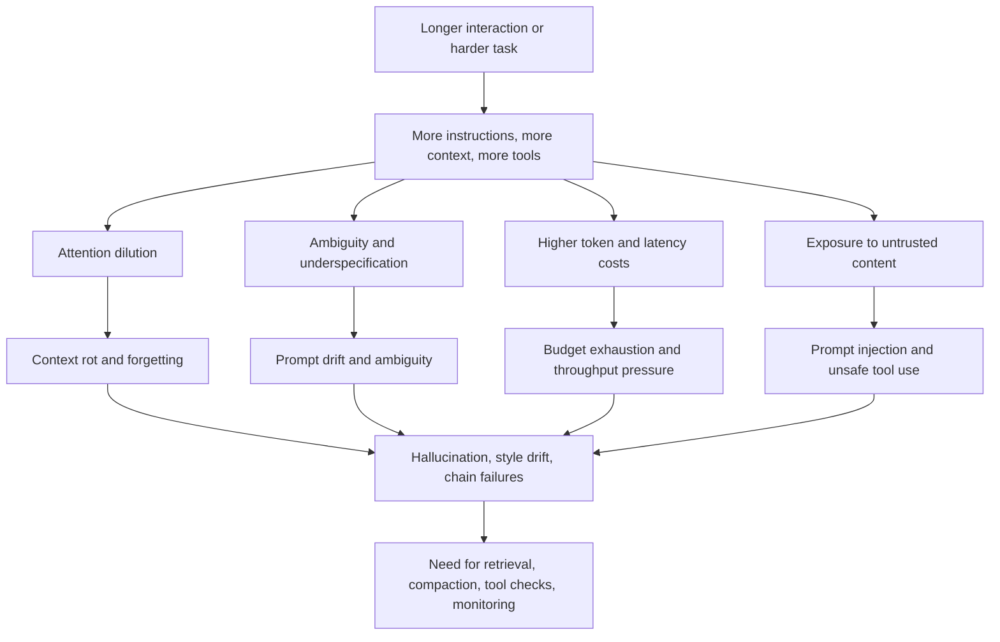
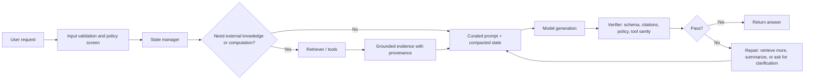

# LLM Output Degradation Across Time and Interactions

## Executive summary

LLM quality does not usually fail in one dramatic step. It more often degrades gradually as the effective prompt becomes crowded, ambiguous, outdated, adversarial, or operationally constrained. The literature and engineering guidance point to ten recurring modes: context rot or forgetting, prompt drift, instruction ambiguity, token budget exhaustion, hallucination increase, style or voice drift, latency and throughput tradeoffs, distributional shift, prompt injection, and cascading errors in multi-step chains. These modes overlap, but they are not identical: some come from attention and memory limits, some from underspecified or shifting instructions, some from stale or missing grounding, and some from system architecture and security boundaries. citeturn23view0turn18view2turn18view0turn19view1turn20search3turn22search0turn29view4turn26view1

The strongest empirical pattern is that “more context” is not the same as “better use of context.” Long-context models still show middle-position failures, retrieval drop-off, and multi-turn reliability loss. In *Lost in the Middle*, models performed best when relevant information was at the beginning or end of context and degraded when it was in the middle. In *NoLiMa*, 11 of 13 models fell below 50% of their short-context baseline by 32K tokens, and GPT-4o dropped from 99.3% to 69.7%. In *LLMs Get Lost in Multi-Turn Conversation*, 15 tested models performed about 35% worse in multi-turn settings, with substantial reliability loss. citeturn18view2turn18view0turn35search7

The second major pattern is that mitigation is mode-specific. There is no single fix called “better prompting.” Context rot is best addressed with curation, compaction, retrieval, quote extraction, and state management; ambiguity is best addressed with explicit schemas, examples, and evaluation; hallucination is best addressed with grounding, retrieval, citations, abstention, and tool use; style drift is best addressed with stable system-level personality and output constraints; latency degradation needs caching, batching, dynamic reasoning budgets, and rate-limit-aware queuing; prompt injection needs defense in depth, privilege separation, and human confirmation for risky actions. citeturn23view0turn25view0turn13view1turn13view2turn24view1turn23view3turn34search0turn29view0turn29view2

A practical implication follows from the evidence: robust LLM systems should be engineered as *stateful, grounded, evaluable pipelines*, not as a single static prompt. The most reliable production pattern combines explicit instruction hierarchy, controlled context management, retrieval with provenance, tool use for external facts and computation, careful handling of hidden or preserved reasoning state, input validation, rate limiting, and continuous monitoring against task-specific evals. citeturn31view1turn33search0turn33search10turn26view0turn25view2turn25view3turn27search2turn32search1

## Scope, definitions, and measurement

In this report, **degradation** means a drop in answer usefulness, correctness, controllability, or safety as an interaction grows longer, is revised across turns, or is exposed to changed inputs and constraints. Some of these labels are standardized in the literature, such as hallucination, out-of-distribution robustness, or indirect prompt injection. Others, especially **prompt drift** and **token budget exhaustion**, are better understood as engineering terms that map onto prompt sensitivity, underspecification, multi-turn reliability loss, truncation, or compaction failures. That operational framing is important because the mitigations differ even when the symptoms look similar. citeturn20search3turn22search0turn29view4turn19view1turn35search7

A useful measurement principle is to separate **capability loss** from **reliability loss**. A model can have enough raw capability to answer correctly in the best case, yet still degrade badly across different prompt phrasings, turn orders, positions in context, or chain depths. That distinction appears explicitly in recent multi-turn studies, prompt sensitivity work, and long-context benchmarking. citeturn35search7turn22search1turn18view2turn18view0



The most useful metrics are task-linked rather than generic. Long-context failures are best tracked with answer accuracy by evidence position, retrieval recall, or grounded citation support. Prompt drift and ambiguity are better tracked with paraphrase variance, IFEval-style instruction pass rates, and regression across prompt versions. Hallucinations are better tracked with groundedness, TruthfulQA-style truthfulness, citation support rates, or inconsistency detectors such as SelfCheckGPT. Operational degradation is better tracked with p50 and p95 latency, tokens per request, cache hit rate, throughput, 429s, and queue delays. Security degradation is better tracked with attack success rate, tool misuse rate, and confirmation frequency for sensitive actions. citeturn18view2turn19view0turn22search1turn20search0turn20search1turn21search0turn34search0turn34search8turn30view0turn29view1

The table below summarizes high-signal empirical results that are especially relevant to “degradation over time or across interactions.”

| Finding | Metric or benchmark | Representative evidence |
|---|---|---|
| Long contexts are position-sensitive | Accuracy drops when relevant evidence is in the middle | *Lost in the Middle* shows highest performance when evidence is at the beginning or end, and marked degradation for middle positions. citeturn18view2 |
| Long-context recall can collapse even when short-context accuracy is high | Relative performance vs short-context baseline | *NoLiMa* reports that at 32K tokens, 11 of 13 models fall below 50% of their strong short-context baseline; GPT-4o falls from 99.3% to 69.7%. citeturn18view0 |
| Multi-turn interaction itself causes losses | Single-turn vs multi-turn performance | *LLMs Get Lost in Multi-Turn Conversation* reports about a 35% drop in multi-turn settings across 15 LLMs. citeturn35search7 |
| Hallucinations can worsen with longer multi-turn interaction | Hallucination benchmark with inline citation grounding | *HalluHard* states that hallucination worsens in multi-turn dialogue as context grows, and remains substantial even with web search, around 30% for its strongest configuration. citeturn35search0 |
| Prompt tweaks can materially change long-context recall | Prompted retrieval accuracy | Anthropic reports a prompt change that improved a long-context retrieval eval from 27% to 98% on Claude 2.1. citeturn28view1 |
| Better retrieval pipelines reduce downstream degradation | Failed retrieval rate | Anthropic reports Contextual Retrieval reduces failed retrievals by 49%, and by 67% when combined with reranking. citeturn25view0 |
| Reasoning and tool use can reduce chain failures | End-to-end task success and error propagation | *ReAct* reports reduced hallucination and error propagation on HotpotQA and FEVER, and absolute success gains of 34% on ALFWorld and 10% on WebShop. citeturn26view1 |
| Quality and latency are a frontier, not independent knobs | Accuracy under latency constraints | *Latency-Aware Test-Time Scaling* reports a 32B model reaching 82.3% on MATH-500 within 1 minute and notes that compute-optimal is not always latency-optimal. citeturn24view0 |

## Degradation in context and instruction handling

The first cluster of failure modes is mostly about **what the model is trying to do** and **which parts of the conversation it is effectively attending to**. These are the modes most teams encounter first when they scale from single-turn prompting to long-running assistants or agents. citeturn23view0turn35search7turn19view1

| Mode | Definition and mechanism | Causes | Symptoms and metrics | Representative evidence | Typical mitigations |
|---|---|---|---|---|---|
| **Context rot and forgetting** | Long prompts behave like overloaded working memory. As token count grows, relevant spans become harder to retrieve or use, especially away from attention-favored positions. Anthropic explicitly describes this as “context rot.” citeturn23view0turn18view2 | Long histories, uncurated transcripts, duplicated context, distractors, poor ordering, middle-position burial. citeturn23view0turn18view2turn18view0 | Accuracy by evidence position; retrieval recall; quote extraction recall; grounded citation support; turn-position failure rate. citeturn18view2turn18view0turn28view0 | *Lost in the Middle*; *NoLiMa*; Anthropic long-context docs and prompting posts. citeturn18view2turn18view0turn23view0turn28view1 | Curate context aggressively; place critical instructions prominently; use compaction and trimming; prefer retrieval or quote extraction over replaying everything; summarize stale history into stable state. citeturn23view0turn33search10turn28view0turn25view0 |
| **Prompt drift** | In this report, prompt drift means cumulative divergence between intended behavior and the *effective* instruction set after prompt edits, follow-up turns, or template changes. Academic work usually studies this as prompt sensitivity, underspecification, and multi-turn reliability loss. citeturn22search1turn19view1turn35search7 | Rephrasing, template changes, added policy layers, hidden assumptions, iterative edits, inconsistent delimiters, mixed goals in one prompt. citeturn22search1turn19view1turn28view2 | Output variance across paraphrases; POSIX prompt sensitivity; regression across prompt versions; higher best-case/worst-case gap across multi-turn simulations. citeturn22search1turn35search7 | *POSIX* finds increased parameter count or instruction tuning does not necessarily reduce prompt sensitivity, while even one few-shot exemplar often helps. *What Prompts Don’t Say* finds underspecified prompts are 2x more likely to regress and can lose more than 20% accuracy. citeturn22search1turn19view1 | Use stable system prompts; keep one canonical template; add explicit requirements, examples, and delimiters; version prompts; run evals on paraphrases and follow-ups, not one golden prompt. citeturn28view2turn28view3turn32search1 |
| **Instruction ambiguity** | The model receives instructions that are incomplete, conflicting, or unclear about authority, scope, or output format. Instruction-following then degrades even when the task is otherwise solvable. citeturn19view0turn31view1turn31view0 | Underspecified requirements, missing schemas, conflicting higher- and lower-priority instructions, vague terms such as “brief” or “formal,” or overloaded prompts that ask for incompatible goals. citeturn19view1turn31view1turn28view2 | IFEval pass rate; schema conformance; clarification need; assumption-induced errors; conflict resolution failures. citeturn19view0turn13view1 | IFEval introduced 25 verifiable instruction types across roughly 500 prompts. OpenAI’s Model Spec formalizes instruction hierarchy and ambiguity handling via a “chain of command.” citeturn19view0turn31view1turn31view0 | Use explicit schemas and structured outputs; separate constraints from task context; encode authority and scope clearly; require abstention or clarification when information is missing; use examples for borderline cases. citeturn13view1turn31view1turn28view2 |
| **Token budget exhaustion** | The context window and output budget together function as a hard operational limit. When the prompt grows, history is pruned, compacted, or summarized; when reasoning tokens grow, latency and cost rise and context can be squeezed. citeturn23view0turn23view4turn23view2 | Long chat history, preserved reasoning blocks, verbose tool outputs, over-large retrieved chunks, no compaction, high reasoning budgets, repeated full-history replay. citeturn23view4turn33search10turn23view3 | Prompt token count; truncation or compaction frequency; dropped-turn rate; percent of context occupied by tools or reasoning; max-token failures. citeturn23view4turn33search10turn23view2 | Anthropic advises server-side compaction for long-running conversations and warns that more context is not automatically better. Its extended-thinking docs show previous thinking tokens and tool-use tokens contribute to effective context calculations. OpenAI similarly recommends compaction and warns against manual pruning when using preserved response state. citeturn23view0turn23view4turn33search10turn33search0 | Use compaction, retrieval, chunking, rolling summaries, tool-result clearing, and stateful conversation APIs; keep system prompts stable and cacheable; monitor context utilization continuously. citeturn23view0turn23view3turn33search10turn33search0 |
| **Style or voice drift** | Output remains roughly on-task but slowly departs from the intended persona, tone, or formatting conventions over turns. citeturn13view0turn13view2turn13view1 | Persona placed only in early turns, weak system instructions, excessive examples with conflicting tone, underspecified style, or long interactions that favor local recency over global persona. citeturn13view0turn13view2turn13view1 | Persona consistency score; lexical style distance; formatting drift; role-break frequency; schema violations. citeturn13view0turn13view1 | *Examining Identity Drift in Conversations of LLM Agents* finds that larger models can experience greater identity drift and that assigning a persona may not reliably help. OpenAI’s personality cookbook recommends system-level personality instructions to reduce drift. Anthropic explicitly recommends “keep Claude in character” with system prompts and scenario preparation. citeturn13view0turn13view2turn13view1 | Put voice and persona at the system level; separate style controls from task instructions; use structured outputs where possible; periodically restate the stable persona in compact form; evaluate style consistency explicitly. citeturn13view2turn13view1 |

A striking lesson from this cluster is that **prompt engineering is really context engineering** once interactions become long or stateful. Anthropic makes this point directly in its context-engineering guidance, and OpenAI’s stateful Responses documentation reaches a similar conclusion from the API side: preserved state, compaction, and careful continuation matter as much as wording one good prompt. citeturn12search23turn33search0turn33search10turn27search2

## Degradation in factuality, robustness, security, and operations

The second cluster concerns whether the model’s answers remain **true, grounded, robust to new conditions, safe against hostile content, and performant under real deployment constraints**. These are the failure modes that turn prototype-quality systems into unreliable production systems if they are not handled architecturally. citeturn20search3turn22search0turn29view4turn24view0

| Mode | Definition and mechanism | Causes | Symptoms and metrics | Representative evidence | Typical mitigations |
|---|---|---|---|---|---|
| **Hallucination increase** | The model produces fluent content not supported by the prompt, references, or reality. OpenAI argues standard training and evaluations often reward guessing over calibrated abstention. HalluLens distinguishes intrinsic and extrinsic hallucinations. citeturn20search3turn20search7turn21search0 | Missing or weak grounding, stale parametric knowledge, pressure to answer, long context with poor retrieval, uncertainty miscalibration, or compounding errors in dialogue. citeturn20search0turn20search1turn35search0 | TruthfulQA accuracy; citation support rate; groundedness; contradiction under resampling; semantic entropy or self-consistency gaps. citeturn20search0turn20search1turn21search0turn35search16 | *TruthfulQA* found the best model in its study truthful on only 58% of questions versus 94% for humans, and larger models were often less truthful. *HalluHard* reports that the problem worsens in multi-turn dialogue and remains material even with web search. citeturn20search0turn35search0 | Ground answers in retrieved sources; require citations; use calculators/search/tools for factual or computational subproblems; detect inconsistency; train for truthfulness and calibrated uncertainty; allow “I don’t know.” citeturn26view0turn25view2turn25view3turn20search3turn20search1 |
| **Latency and throughput tradeoffs** | Quality often improves with more reasoning or more sampled trajectories, but cost and latency also rise. Under service pressure, developers shorten prompts, reduce reasoning budgets, or switch to smaller models, which can itself degrade output. citeturn24view0turn24view1turn23view2 | Large contexts, long chain-of-thought, high thinking budgets, parallel branches, limited hardware, poor caching, rate-limit saturation. citeturn24view0turn24view1turn23view3turn34search0 | p50/p95 latency; time-to-first-token; tokens per second; cache hit rate; 429 frequency; timeout rate; quality under latency budget. citeturn24view1turn23view3turn34search8turn34search3 | Anthropic notes that larger thinking budgets can improve quality but increase latency, often with diminishing returns. Gemini exposes explicit `thinkingBudget` and `thinkingLevel` controls. Research on latency-aware test-time scaling shows compute-optimal is not always latency-optimal, and STAND reduces latency by 60–65% at the same performance in best-of-16 settings. citeturn24view1turn23view2turn24view0turn24view2 | Prompt caching, batching, speculative decoding, adaptive reasoning budgets, model routing, rate limiting, retries with backoff, and asynchronous or batched workloads for non-interactive tasks. citeturn23view3turn24view2turn34search0turn34search4 |
| **Distributional shift** | Inputs, domains, or prompt realizations differ from the model’s training or tuning distribution. Performance that looks strong on one benchmark or template may fail on new domains, paraphrases, or user phrasing. citeturn22search0turn22search1turn19view1 | New domain data, user paraphrases, prompt spelling and template changes, changed task formulations, evolving business policies. citeturn22search0turn22search1turn19view1 | OOD accuracy/F1; prompt sensitivity index; regression across domains and paraphrases; calibration shift. citeturn22search0turn22search1 | An OOD robustness study reports limited transferability between adversarial and OOD robustness and model-specific patterns. POSIX shows even meaning-preserving prompt changes can significantly alter behavior. *What Prompts Don’t Say* shows underspecified prompts are especially fragile across model and prompt changes. citeturn22search0turn22search1turn19view1 | Expand eval sets to cover paraphrases, domains, and recency; include few-shot exemplars where appropriate; prefer grounding with fresh retrieval; use monitoring and canary prompts after model or template changes. citeturn22search1turn32search1turn25view0 |
| **Prompt injection** | Untrusted text is interpreted as instructions. In indirect prompt injection, adversarial commands arrive through web pages, emails, documents, or tool outputs rather than the user directly. citeturn29view4turn30view0turn29view0 | Instruction/data conflation, agents with broad tools, access to untrusted content, insufficient privilege separation, weak confirmation policy. citeturn29view4turn30view0turn29view2 | Attack success rate; exfiltration rate; unauthorized tool actions; detector precision/recall; false negatives on third-party content. citeturn30view0turn29view2 | *Not what you’ve signed up for* introduced indirect prompt injection attacks against real systems. *BIPIA* found existing LLMs “universally vulnerable,” and its proposed boundary-awareness and explicit-reminder defenses substantially mitigate attacks, with the white-box defense reducing attack success to near zero. Anthropic reports improved browser robustness but explicitly states prompt injection remains unsolved. citeturn29view4turn30view0turn29view2 | Treat all external content as untrusted; separate instructions from data; minimize tool privileges; strip or quarantine unsafe tool outputs; add classifiers and policy checks; require human confirmation for sensitive actions; log and monitor suspicious tool use. citeturn29view0turn29view1turn29view2turn14search14 |
| **Cascading errors in multi-step chains** | An early mistake contaminates later reasoning, retrieval, or tool decisions, causing compounding failures. This is common in ReAct-style agents, long CoT traces, and multi-turn chat. citeturn26view1turn35search7turn35search0 | Sequential dependencies, no step verification, weak retrieval at early steps, hidden assumption errors, brittle tool selection, or over-reliance on one bad subgoal. citeturn26view1turn35search0turn16search16 | End-to-end success; per-step verification pass rate; error-attribution depth; recovery rate after early faults; hallucination by turn position. citeturn26view1turn35search0turn35search4 | *ReAct* explicitly frames acting plus reasoning as a way to reduce hallucination and error propagation. *LLMs Get Lost in Multi-Turn Conversation* shows large multi-turn reliability losses. *HalluHard* finds earlier errors and growing context worsen factual grounding. citeturn26view1turn35search7turn35search0 | Break work into verifiable subtasks; use tools for facts and arithmetic; verify intermediate outputs; maintain scratchpads or structured state; use self-consistency or iterative refinement where latency permits. citeturn25view2turn25view3turn6search3turn7search2 |

A central theme across this cluster is that **factual and security degradation both get worse when the system is forced to “guess”**—guess the intended instruction, guess the missing fact, guess which tool to call, or guess whether untrusted content is data or authority. The strongest mitigations therefore reduce guessing by adding grounded evidence, explicit control flow, or confirmation gates. citeturn20search3turn26view1turn30view0turn29view1

## Mitigation patterns and architectural guidance

The most reliable mitigation stack is layered. The literature does not support a “one weird trick” story. Strong systems combine **prompt design**, **context management**, **grounding**, **tool use**, **state management**, **efficiency controls**, and **monitoring**. citeturn28view3turn23view0turn26view0turn25view2turn33search0turn34search0turn32search1

### Prompt engineering and instruction design

Prompt engineering remains important, but its most robust uses are narrow and explicit: defining output format, encoding authority hierarchy, giving examples, isolating task steps, and specifying when to abstain. Anthropic recommends clarity, examples, XML structuring, prompting chains, and explicit consistency techniques. Google recommends precise instructions, consistent structure, clear delimiters, critical instructions at the beginning, and the question at the end for long contexts. OpenAI’s prompt guidance advises explicit reasoning instructions when needed, instruction duplication at beginning and end for long contexts, and careful handling of missing information to prevent tool hallucination. citeturn13view1turn28view2turn27search3

### Context window management, chunking, and summarization

Once interactions become long, context must be curated rather than merely accumulated. Anthropic explicitly warns that accuracy and recall degrade as token count grows and recommends server-side compaction for long-running interactions. OpenAI similarly recommends compaction when using stateful Responses, and notes that the latest compaction item carries the necessary context while earlier items can be dropped. Google’s long-context guidance notes that smaller-window models often require dropping old messages, summarizing, filtering, or RAG. citeturn23view0turn33search10turn23view1

### Retrieval-augmented generation and grounding

RAG is still the most general-purpose mitigation for factual drift when the needed knowledge is external, dynamic, or too large for the prompt. The original RAG paper showed that combining parametric and non-parametric memory improved knowledge-intensive QA and produced more factual generations than a parametric-only baseline. Anthropic’s Contextual Retrieval post shows that improving the retrieval stage itself can meaningfully reduce downstream failures, especially when embeddings are combined with lexical retrieval and reranking. citeturn26view0turn25view0

### Instruction tuning, RLHF, and AI feedback

Post-training helps when the failure mode is systematic rather than prompt-local. InstructGPT demonstrated that a 1.3B preference-tuned model could be preferred to the 175B GPT-3 baseline and also improved truthfulness while reducing toxicity. Constitutional AI extended this logic by using self-critique and AI feedback to improve harmlessness. These methods do not eliminate prompt-local ambiguity or long-context failures, but they often improve the model’s default behavior when prompts are imperfect. citeturn8search0turn8search3turn7search1

### Tool use and external verification

Tooling is the strongest mitigation when the task depends on current facts, exact arithmetic, database access, or transactional state. Toolformer showed that models can learn to call APIs and materially improve zero-shot performance without losing core language ability. ReAct showed that interleaving reasoning and actions reduces hallucination and error propagation by letting the model fetch or verify the information it needs. In vendor practice, hosted tools and stateful APIs also reduce round trips and help preserve reasoning or conversation state across turns. citeturn25view3turn26view1turn27search2turn33search0

### Caching, rate limiting, and monitoring

Operational mitigations prevent quality collapse under load. Anthropic and OpenAI both document prompt caching as a way to reduce latency and cost, especially when system instructions or large stable contexts repeat. Rate limits are not merely billing constraints; they are part of keeping predictable throughput and preventing degraded service under overload. For evaluation, Anthropic recommends explicit success criteria and prompt or model evals before shipping. Production systems should also log request IDs, token counts, cache hit rates, stage-by-stage latency, and attack indicators. citeturn23view3turn10search9turn34search0turn34search3turn32search1turn34search1



## Case studies and implementation examples

The following examples are intentionally simple. They illustrate robust patterns that line up with the research and vendor guidance above rather than any one provider-specific SDK. citeturn23view0turn25view0turn27search3turn33search10

### Rolling summarization for long conversations

This pattern combats context rot and token budget exhaustion by converting stale dialogue into stable state. It follows the logic of compaction and “summary memory” rather than replaying every turn. citeturn23view0turn33search10

```python
def update_conversation_state(turns, summary, token_counter, max_input_tokens=64000):
    """
    Keep recent turns verbatim, compress older turns into a stable summary.
    """
    recent = []
    running_tokens = 0

    # keep newest turns that still fit
    for turn in reversed(turns):
        t = token_counter(turn["content"])
        if running_tokens + t > max_input_tokens * 0.5:
            break
        recent.append(turn)
        running_tokens += t
    recent.reverse()

    stale_turns = turns[: len(turns) - len(recent)]
    if stale_turns:
        new_summary = summarize([
            {"role": "system", "content": (
                "Update the conversation summary. Preserve user goals, constraints, "
                "open questions, decisions already made, and facts explicitly established. "
                "Do not add unsupported inferences."
            )},
            {"role": "user", "content": {
                "previous_summary": summary,
                "stale_turns": stale_turns,
            }},
        ])
    else:
        new_summary = summary

    return {
        "summary": new_summary,
        "recent_turns": recent,
    }
```

A good summary should preserve durable facts, user preferences, decisions, and unresolved questions, while dropping low-value language and reducing local noise. If summaries are allowed to add speculative inferences, they can become a source of downstream hallucination rather than a cure for context rot. That is why grounding language that forbids unsupported inference is helpful here. citeturn28view2turn20search3

### Context trimming with anchored instructions

This pattern addresses prompt drift and forgetting by protecting instructions and trimming low-value context first. citeturn28view2turn23view0

```python
def build_prompt(system_rules, stable_profile, summary_state, retrieved_evidence, recent_turns):
    return [
        {"role": "system", "content": system_rules},          # highest-priority behavior
        {"role": "system", "content": stable_profile},        # persona / tone / formatting
        {"role": "system", "content": summary_state},         # compact durable memory
        {"role": "user", "content": "<evidence>\n" + retrieved_evidence + "\n</evidence>"},
        *recent_turns,
        {"role": "user", "content": (
            "Based only on the evidence above and the current conversation, answer the user. "
            "If the evidence is insufficient, say so explicitly."
        )},
    ]
```

This reflects three repeatedly supported design choices: keep global behavior stable at the system level, keep evidence separate from instructions using delimiters, and require explicit abstention when evidence is insufficient. citeturn31view1turn28view2turn13view2

### Retrieval with citations and quote extraction

This pattern combats hallucinations and factual drift by forcing the model to cite the evidence it actually used. It is especially useful in legal, technical, policy, and research workflows. citeturn26view0turn25view0turn35search0

```python
def answer_with_retrieval(question, vector_index, bm25_index, reranker, llm):
    # hybrid retrieval
    dense_hits = vector_index.search(question, top_k=20)
    sparse_hits = bm25_index.search(question, top_k=20)
    merged_hits = deduplicate(dense_hits + sparse_hits)

    # rerank and keep only the best evidence
    top_passages = reranker.rank(question, merged_hits)[:6]

    prompt = f"""
    <task>
    Answer the question using only the passages below.
    Every factual claim must be followed by a citation like [P2].
    If the passages do not support an answer, say "Insufficient evidence."
    First extract the exact supporting quotes, then answer.
    </task>

    <question>{question}</question>

    <passages>
    {"".join(f"[P{i+1}] {p.text}\n" for i, p in enumerate(top_passages))}
    </passages>
    """
    return llm(prompt)
```

This pattern deliberately separates retrieval from synthesis. Anthropic’s long-context prompting guidance showed that asking for relevant quotes before answering can improve recall, and its Contextual Retrieval guidance shows that better retrieval preprocessing materially reduces failed retrievals. citeturn28view0turn25view0

### Visible chain-of-thought versus hidden scratchpad

OpenAI’s guidance distinguishes between models that reason internally and those where developers may induce explicit planning in the prompt. In production, a good default is to keep *structured reasoning state* or a *scratchpad* for the system, but expose only the concise answer and supporting evidence to the user unless the workflow explicitly benefits from showing reasoning steps. That helps with verbosity, leakage, and style drift while still supporting multi-step control flow. citeturn27search3turn27search2turn33search6

```python
# safer: keep planning separate from final answer
planner_prompt = """
You are a planner. Produce JSON with:
- subgoals
- facts_needed
- tools_needed
- uncertainties
Do not answer the user directly.
"""

executor_prompt = """
You are an answerer.
Use the verified planner output and tool results.
Return:
- answer
- citations
- unresolved_uncertainties
"""
```

The tradeoff is straightforward. Explicit chain-of-thought can improve some tasks because it makes planning legible and decomposes the task, but it also increases tokens, latency, and potential brittleness. OpenAI’s prompt guidance says step-by-step prompting can improve quality, but at higher cost and latency. Anthropic’s extended thinking docs make the same tradeoff explicit for larger reasoning budgets. citeturn27search3turn24view1

### Prompt template for ambiguity control

This template reduces underspecification, improves instruction-following, and constrains style drift.

```text
# Role
You are a policy-grounded research assistant.

# Objective
Answer the user’s question accurately and concisely.

# Hard constraints
- Use only the evidence in <sources>.
- Cite each factual claim with source IDs.
- If evidence is insufficient, say so.
- Keep tone professional and neutral.

# Output schema
{
  "answer": "...",
  "citations": ["S1", "S3"],
  "uncertainties": ["..."]
}

# Sources
<sources>
[S1] ...
[S2] ...
[S3] ...
</sources>

# User question
...
```

This works because it separates behavior, grounding, and format. Anthropic’s consistency guidance recommends specifying the output format precisely and using retrieval for contextual consistency. Google recommends clear delimiters, defined parameters, and consistent structure. IFEval-style tasks show why verifiable constraints matter. citeturn13view1turn28view2turn19view0

## Mapping table

The table below maps the ten degradation modes to their best-supported mitigations, along with the main tradeoffs and implementation complexity.

| Degradation mode | Best mitigation set | Main tradeoff | Implementation complexity |
|---|---|---|---|
| Context rot and forgetting | Context compaction, rolling summarization, hybrid retrieval, quote extraction, evidence ordering, prompt caching for stable prefixes. citeturn23view0turn25view0turn33search10turn23view3 | Summaries can oversimplify; retrieval can miss; more engineering than raw long-context prompting. | Medium |
| Prompt drift | Canonical prompt templates, prompt versioning, paraphrase evals, few-shot anchors, consistent delimiters and sections. citeturn22search1turn19view1turn28view2turn32search1 | More rigidity can reduce flexibility and creativity. | Low to medium |
| Instruction ambiguity | Structured outputs, explicit authority hierarchy, schemas, examples, abstention rules, clarification or safe-guess policies. citeturn13view1turn31view1turn19view0 | Can increase prompt length and occasionally overconstrain outputs. | Low |
| Token budget exhaustion | Server-side compaction, stateful APIs, chunking, tool-result clearing, reasoning-budget controls, token monitoring. citeturn23view0turn23view4turn33search0turn33search10 | More moving parts; compacted state can lose nuance if done poorly. | Medium |
| Hallucination increase | RAG, required citations, tool use for search/calculation, calibrated abstention, self-checking, truthfulness-oriented post-training. citeturn26view0turn20search3turn20search1turn25view3turn8search0 | Retrieval and verification add latency and infrastructure overhead. | Medium to high |
| Style or voice drift | System-level personality, explicit tone constraints, schema or template enforcement, periodic persona refresh in compact form. citeturn13view2turn13view1turn13view0 | Strong style controls can make output feel repetitive or less adaptive. | Low |
| Latency and throughput tradeoffs | Prompt caching, batching, model routing, adaptive thinking budgets, speculative decoding, backoff and rate-limit-aware queueing. citeturn23view3turn24view1turn24view2turn34search0turn34search4 | Quality may fall if budgets are cut too aggressively; more orchestration logic. | Medium to high |
| Distributional shift | Broader eval suites, fresh retrieval, paraphrase and OOD testing, canary prompts, monitored rollouts after prompt or model changes. citeturn22search0turn22search1turn32search1 | More evaluation cost and slower release cadence. | Medium |
| Prompt injection | Defense in depth: input screening, boundary awareness, privilege separation, confirmation gates, least-privilege tools, suspicious-action logging. citeturn29view0turn30view0turn29view1turn29view2 | Friction for users; false positives; some attacks remain unsolved. | High |
| Cascading errors in multi-step chains | ReAct-style tool use, step verification, structured scratchpads, self-consistency, iterative refinement, intermediate checkpoints. citeturn26view1turn6search3turn7search2turn35search7turn35search0 | More latency and cost; harder orchestration and observability. | Medium to high |

Across nearly all rows, three mitigations recur because they attack the deepest causes rather than just the symptoms: **grounding**, **state management**, and **evaluation**. Grounding reduces unsupported guessing; state management prevents uncontrolled context growth; evaluation catches regressions that otherwise masquerade as “randomness.” citeturn26view0turn33search0turn32search1

## Appendix

### Key sources and links

For long-context degradation and context management, the most important primary sources are *Lost in the Middle*, *NoLiMa*, Anthropic’s context-window and long-context prompting guidance, Google’s long-context and prompt-strategy documentation, and OpenAI’s compaction and conversation-state documentation. citeturn18view2turn18view0turn23view0turn28view1turn23view1turn28view2turn33search10turn33search0

For prompt drift, ambiguity, and instruction following, the most useful sources are IFEval, POSIX, *What Prompts Don’t Say*, OpenAI’s Model Spec and “approach to the Model Spec,” Anthropic’s consistency guidance, and OpenAI’s prompt guidance. citeturn19view0turn22search1turn19view1turn31view1turn31view0turn13view1turn27search3

For hallucination and grounding, the anchor sources are *TruthfulQA*, *SelfCheckGPT*, *HalluLens*, OpenAI’s “Why language models hallucinate,” the original RAG paper, Anthropic’s Contextual Retrieval post, ReAct, and Toolformer. citeturn20search0turn20search1turn21search0turn20search3turn26view0turn25view0turn26view1turn25view3

For operational and agentic reliability, the most relevant sources are Anthropic’s extended-thinking, prompt-caching, monitoring, and guardrail docs; OpenAI’s Responses API, rate-limit, production, and state-management docs; and the recent latency-aware test-time scaling and speculative decoding work. citeturn24view1turn23view3turn32search0turn29view0turn27search2turn34search0turn34search3turn33search0turn24view0turn24view2

For prompt injection and cascading failures, the core sources are *Not what you’ve signed up for*, *BIPIA*, Anthropic’s browser-use injection defense write-up, Anthropic’s computer-use safety docs, *LLMs Get Lost in Multi-Turn Conversation*, *HalluHard*, and ReAct. citeturn29view4turn30view0turn29view2turn29view1turn35search7turn35search0turn26view1

### Open questions and limitations

Several important questions remain unsettled. First, vendor long-context claims are not directly comparable because benchmarks, prompt formats, and retrieval assumptions differ materially across papers and blog posts. Second, prompt injection remains an open problem in fully autonomous, high-privilege agents; even Anthropic’s recent browser-use work presents progress rather than a complete solution. Third, hallucination measurement is still fragmented: truthfulness, faithfulness to sources, and consistency under resampling are related but not identical metrics. Finally, some recent multi-turn and agent benchmarks are evolving quickly, so the highest-confidence conclusions today are the broad ones: quality does degrade across turns and long contexts; the degradation is measurable; and layered architecture mitigates it better than prompt-only fixes. citeturn18view2turn18view0turn29view2turn21search0turn35search0turn35search7