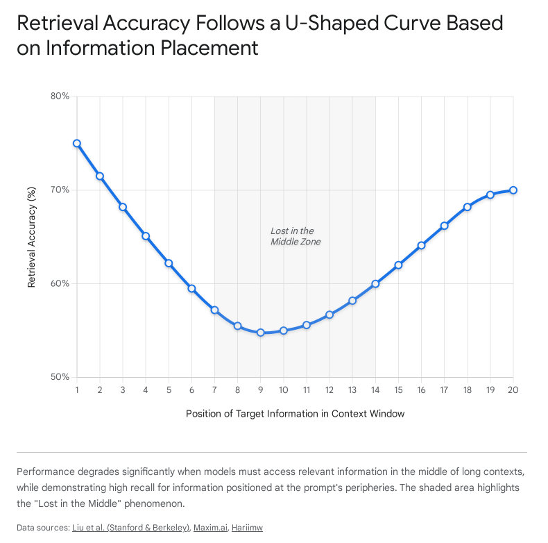
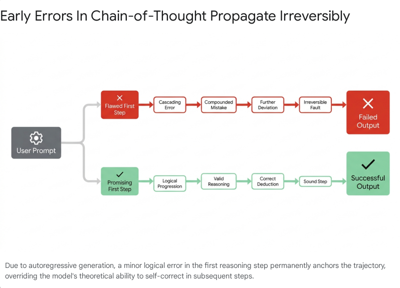

Architectural Vulnerabilities and Mitigation Strategies in Large Language Model Context Utilization

Introduction: The Illusion of Infinite Context

The rapid scaling of Large Language Models (LLMs) has been accompanied by a corresponding expansion in context window capacities. Modern architectures are now theoretically capable of processing hundreds of thousands, or even millions, of tokens within a single inference pass. However, empirical observation and rigorous benchmarking reveal a critical divergence between this theoretical capacity and the functional utilization of the provided data. The ingestion of extensive sequence data does not linearly translate to comprehensive semantic retrieval or robust reasoning capabilities. Instead, as context length scales, LLM outputs systematically degrade through a complex confluence of architectural biases, attention dilution, accumulated noise, and temporal state drift.

This degradation manifests across multiple distinct failure modes, each requiring unique analytical frameworks and engineered mitigations. Information sequestered in the center of long documents is frequently ignored by the attention mechanism, a phenomenon documented extensively as the "Lost in the Middle" anomaly. Simultaneously, the proliferation of complex system instructions and exhaustive tool catalogs introduces severe token bloat, precipitating a silent erosion of output quality known as context rot. Furthermore, prolonged reasoning trajectories are uniquely vulnerable to early-stage generative errors, while multi-turn conversational interactions suffer from state-space drift and catastrophic forgetting over time.

Addressing these degradation vectors requires moving entirely beyond the naive approach of continuous context scaling. Modern production deployments and enterprise applications necessitate a paradigm shift toward intelligent context curation, architectural attention calibration, dynamic memory state management, and parameter-efficient routing. This comprehensive report provides an exhaustive analysis of the phenomenological mechanisms driving LLM output degradation and systematically evaluates the state-of-the-art algorithmic, architectural, and retrieval-augmented interventions engineered to combat these systemic vulnerabilities.

1. The Anatomy of Contextual Degradation and Attention Dilution

The failure of contemporary language models to process extended contextual payloads uniformly stems from inherent structural limitations in how transformer architectures distribute mathematical attention and represent positional relationships across vast token sequences. Understanding these failure modes requires disaggregating the specific ways in which models lose track of, misinterpret, or actively overwrite critical information provided in their prompts.

1.1 The "Lost in the Middle" Anomaly and Positional Bias

The "Lost in the Middle" (LitM) phenomenon represents one of the most pervasive and well-documented vulnerabilities in long-context utilization. Despite possessing nominal context windows spanning thousands or millions of tokens, models systematically fail to retrieve, integrate, or reason over information positioned centrally within the input sequence.

Performance across complex, multi-document question-answering pipelines and highly specific key-value retrieval tasks demonstrates a pronounced U-shaped accuracy curve. Models reliably extract and utilize information located at the absolute beginning of the prompt (leveraging the primacy effect) or the absolute end of the prompt (leveraging the recency effect). However, when target facts or crucial operational instructions are buried in the middle of a massive context window, retrieval accuracy can precipitously degrade by more than 30%, rendering the expansive context window functionally hollow.

This anomaly is primarily driven by positional encoding biases intrinsic to modern transformer designs, specifically the decay inherent in mechanisms like Rotary Position Embedding (RoPE). RoPE mathematically encodes absolute position with a rotation matrix while incorporating explicit relative position dependencies in the self-attention formulation. While highly effective for sequence length flexibility, a fundamental property of RoPE is decaying inter-token dependency as relative distances increase. This mathematical decay prioritizes tokens at the extreme boundaries, causing attention weights applied to the center of the payload to aggressively dilute.

Furthermore, deep empirical analysis of this degradation reveals a differential impact on discrete model capabilities. As context length expands, the model's capacity to pinpoint exactly where the target information is located—measured as the Document Metric—degrades far more severely than its ability to understand what the information represents—measured as the Variable Extraction Metric. This differential degradation is highly instructive; it indicates that the core failure of the "Lost in the Middle" anomaly is not a sudden collapse in semantic comprehension or reasoning, but rather a mechanical failure of the spatial attention mechanism to isolate localized, relevant features within a vast, noisy landscape of tokens. The model retains the ability to process the answer if it can find it, but it mathematically loses the ability to locate it.

1.2 Token Bloat, Context Poisoning, and the Onset of Context Rot

Beyond the inherent architectural biases of the attention mechanism, output degradation is frequently induced by the nature and composition of the context payload itself. The modern engineering trend of augmenting LLMs with expansive prompt libraries, complex multi-step system instructions, and comprehensive API tool schemas has given rise to a secondary, equally destructive failure mode: token bloat.

For instance, in advanced agentic frameworks utilizing the Model Context Protocol (MCP), a catalog of available tools can persistently occupy upwards of 500,000 tokens of the context window before any user query is even processed or retrieved. This massive, persistent saturation leads directly to "context rot"—the gradual, silent degradation of relevance, accuracy, and operational usefulness within an LLM's context window over time. Unlike catastrophic system failures, software bugs, or application crashes, context rot manifests insidiously. The system continues to function and generate responses, masking the underlying issue, but the quality of the outputs slowly and persistently declines. The overwhelming volume of ancillary information, corporate boilerplate, and peripheral tool descriptions dilutes the semantic weight of the user's core query.

When irrelevant, contradictory, or marginally related snippets are injected into this already bloated prompt via naive vector retrieval systems, the result is known as "context poisoning". The model, inherently programmed to synthesize the provided context, attempts to reconcile this injected noise with the ground truth of the user query. This reconciliation attempt results in severe hallucinations complete with citations to non-existent code files or hallucinated document headers, sudden latency spikes as the model processes the vast payload, and a phenomenon known as "hedging". In a hedging scenario, the model produces muddled, non-committal reviews or answers designed to safely cover all conflicting angles presented in the poisoned context, resulting in the LLM equivalent of a reviewer who cannot commit to a distinct technical stance.

The prevailing industry axiom that expanding context windows automatically equates to better, more comprehensive answers is fundamentally flawed; scarce, effective context, rather than raw window size, remains the true binding constraint of LLM performance. A practical operational rule of thumb is emerging: if a piece of context does not directly, immediately, and factually help answer the current question, its inclusion actively harms the model's output.

2. Reasoning Collapse and the Illusion of Self-Correction

While the "Lost in the Middle" phenomenon primarily affects information retrieval and fact extraction tasks, a distinct and equally critical spatial vulnerability exists within complex reasoning and logic tasks. When LLMs generate Long Chain-of-Thought (CoT) reasoning trajectories to solve mathematical or logical word problems, the final output is disproportionately dictated by the earliest tokens generated, creating a massive vulnerability at the inception of the task.

2.1 The "Lost at the Beginning of Reasoning" Vulnerability

Recent empirical research, evaluating complex problem-solving on the AIME24 and AIME25 mathematical benchmarks using models such as DeepSeek-R1-Distill-Qwen-7B and Qwen3-8B, has uncovered a severe generative trap. When mapping the semantic similarity between each individual reasoning step and the final generated conclusion, researchers observe an overwhelming correlation between the very first reasoning step and the ultimate prediction. The similarity scores spike drastically early in the sequence, demonstrating that a strong, logically sound first step almost guarantees an accurate solution requiring fewer total tokens, while a flawed first step inevitably dooms the entire generation.

Consequently, reasoning models are acutely vulnerable during the absolute initial stage of the inference process. A minor hallucination, a misinterpreted variable, or a slight logical flaw in the very first step propagates downstream, irrevocably degrading the entire generation. This phenomenon, formally termed "Lost at the Beginning of Reasoning," highlights the disproportionate influence of initial token sampling on the entire reasoning trajectory.

2.2 The Autoregressive Trap and the Failure of Self-Correction

The discovery of the "Lost at the Beginning" vulnerability directly challenges the prevailing industry assumption that modern, Reinforcement Learning from Human Feedback (RLHF)-trained models possess highly robust self-correction and self-reflection capabilities. While models are often explicitly prompted to review their own work, their ability to spontaneously recognize and reverse early logical missteps during an extended CoT generation is severely overestimated.

To evaluate this rigorously, researchers introduced the LaBoR benchmark, specifically designed to test self-correction by forcing models to continue reasoning from deliberately flawed, pre-generated first steps. The results indicate systemic failure. Once a suboptimal or logically compromised path is chosen in the first step, the autoregressive nature of the transformer architecture effectively locks the model into that reality. The model is forced to continuously justify, rationalize, and build upon the initial error predicting the next most likely token based on the flawed history, leading to an inescapable reasoning collapse.

3. Temporal Degradation: Multi-Turn Drift and Catastrophic Forgetting

While the aforementioned failures occur primarily during single-pass inference or within isolated prompt windows, a distinct class of output degradation occurs over time. These temporal vulnerabilities impact extended conversational agents and models undergoing continuous fine-tuning, threatening long-term reliability and system alignment.

3.1 Conversation Drift and Handoff Instability in Multi-Turn Systems

In enterprise production systems, user interactions rarely consist of a discrete, single-turn prompt and completion. In extended, multi-turn conversational agents, output quality degrades sequentially across the temporal axis of the interaction. Extensive prior work highlights that factual accuracy, long-context coherence, and strict instruction-following capabilities diminish measurably as the conversation elongates.

This multi-turn degradation is exacerbated by a phenomenon known as "conversation drift." As the user and the AI agent exchange continuous messages, the sliding context window shifts forward. Crucially, this shift frequently pushes the original system instructions, ethical guidelines, and overarching behavioral constraints out of the model's immediate focal area or drops them entirely from the context buffer. If the model's response in an early turn diverges even slightly from the established persona, subsequent turns—which rely on the previous outputs as in-context demonstrations—amplify the divergence, leading to a complete breakdown in compliance and social framing.

Furthermore, modern infrastructure introduces mechanical drift. In high-traffic deployments, the underlying computational model fulfilling a specific chat session may not remain static. Due to load balancing, cross-provider fallbacks, or mid-session system upgrades, the model generating the fifth turn may be a different architecture than the one that generated the first. Recent evaluations using switch-matrix benchmarks on datasets like CoQA and Multi-IF demonstrate that this "handoff-induced drift" introduces subtle, cumulative inconsistencies in persona, formatting, and constraint adherence, breaking the continuity of the interaction even if the raw context text is preserved.

3.2 Catastrophic Forgetting in Continual Learning and Fine-Tuning

While conversation drift occurs during the inference phase, an even more severe form of degradation plagues the training and fine-tuning phases: catastrophic forgetting. Also known in machine learning literature as catastrophic interference, this phenomenon occurs when an artificial neural network completely overwrites or loses access to previously learned tasks when being trained sequentially on new data.

When an overparameterized LLM is continually fine-tuned to align with highly specialized enterprise needs, adapt to new domain-specific use cases, or update its factual knowledge base (Task B), the resulting weight parameter updates actively interfere with the functional mathematical representations of previously learned foundational information (Task A). Recognized as a fundamental limitation of neural networks since the foundational McCloskey research in the 1980s, catastrophic forgetting severely complicates the goal of achieving a compounding effect of model alignment over time. As the neural network relentlessly optimizes its loss landscape for the new domain, it effectively destroys the latent knowledge and generalized capabilities acquired during its massive pretraining phase, sacrificing its general intelligence for narrow utility.

Empirical comparisons reveal architectural nuances in this degradation; for example, decoder-only architectures like BLOOMZ often exhibit slightly less catastrophic forgetting and retain more pre-existing knowledge than encoder-decoder models like mT0 during sequential updates, though both remain highly vulnerable without explicit interventions.

4. Foundational Mitigations: Information Architecture and Retrieval

Given that naive context scaling exacerbates output degradation, the most immediate and highly adopted solutions focus on curating, compressing, and structuring the context long before it ever reaches the language model's input vector. By refining the Retrieval-Augmented Generation (RAG) pipeline through advanced data engineering, systems can bypass the model's internal attention weaknesses entirely, providing a surgically precise context payload.

4.1 Overcoming the Lexical Gap with Hybrid Search and Reranking

Standard, or "naive," RAG architectures rely heavily on dense vector embeddings (e.g., the text-embedding-ada-002 model) to capture the broad semantic meaning of documents. While dense vectors excel at matching conceptually similar texts and handling complex paraphrasing, they suffer from a fundamental, critical "lexical gap". Semantic search performs exceedingly poorly on precision tasks that require exact keyword matches. When a user queries a specific technical entity—such as identifying the root cause of an exact 503-AUTH-TIMEOUT error code, an alphanumeric SKU, or specialized medical nomenclature—relying purely on semantic retrieval will often retrieve documents about general "login delays" or "session expiration". These documents are conceptually proximate in the vector space but are factually wrong and useless for solving the specific query, heavily contributing to context poisoning.

To definitively combat this lexical gap, modern production systems implement a Three-Stage Retrieval Architecture centered on Hybrid Search and Cross-Encoder Reranking.

Stage 1: Parallel Hybrid Retrieval. This stage completely merges dense semantic vector search with sparse, highly exact keyword-based algorithms such as BM25 or TF-IDF. Operating concurrently with sub-100ms overhead, the semantic search handles broad contextual mapping while the keyword search firmly anchors the retrieval to precise technical terms, ensuring exact matches are not overlooked. The results are then combined using techniques like Reciprocal Rank Fusion (RRF) to create a broad, highly inclusive candidate pool.

Stage 2: Precision Reranking. The initial hybrid search retrieves a generous candidate pool (typically 20 to 100 documents) to prioritize high recall. However, feeding 100 documents to the LLM invites the "Lost in the Middle" phenomenon. Therefore, the system utilizes computationally intensive Cross-Encoder models (such as BERT-based rerankers) to rigorously evaluate the candidate pool. Unlike standard bi-encoders that compress queries and documents independently into fixed vectors offline (resulting in information loss), cross-encoders process the user's query and the retrieved document jointly at inference time. This allows the cross-encoder's full attention mechanism to model deep, highly nuanced semantic relationships between the specific query and every word of the document text, assigning highly refined relevance scores. While cross-encoders add 50-200ms of latency per document, empirical research shows that reranking dramatically improves final retrieval accuracy by 15-30% compared to embedding-based retrieval alone.

4.2 Advanced Chunking Paradigms: Semantic and Contextual Retrieval

The specific methodology used to partition source documents prior to embedding heavily dictates the quality and coherence of the resulting context. Traditional systems rely on naive, rule-based chunking—blindly splitting text by arbitrary character counts (e.g., 1000 characters) or basic structural separators. This archaic approach ruthlessly disrupts semantic coherence, frequently splitting a single cohesive thought or complex paragraph directly across multiple chunks. This strips the isolated text segments of their broader meaning, leading to catastrophic context loss and incomplete information retrieval.

To mitigate this semantic destruction, the industry has shifted toward two advanced paradigms: Semantic Chunking and Contextual Retrieval.

Chunking Paradigm Methodology Primary Advantage Primary Drawback
Naive / Rule-Based Chunking Splits text by arbitrary token or character limits (e.g., every 500 words). Computationally cheap and instantaneous. Severely disrupts semantic meaning; creates "orphaned" text fragments devoid of context.
Semantic Chunking Uses an embedding model to analyze the vector similarity of adjacent sentences. Breaks text only when a significant semantic shift is detected. Highly cohesive segments that preserve complete ideas and topic boundaries. Requires continuous embedding calculations during the segmentation process, increasing processing time.
Contextual Retrieval (Metadata Injection) Generates a global document summary using an LLM, then prepends this summary to every naive or semantic chunk before final vectorization. Solves the orphaned chunk problem completely; provides flawless document-level context to highly granular text snippets. Highest upfront cost; requires a preliminary LLM pass over the entire document corpus before indexing.

Semantic Chunking shifts the paradigm from structural segmentation to meaning-based segmentation. The algorithm breaks the document into individual sentences, generates a vector embedding for each sentence, and performs a continuous similarity analysis between adjacent pairs. When a significant statistical drop in semantic similarity is detected, the algorithm assumes the topic has changed and creates a new chunk boundary. This guarantees that chunks are ideologically cohesive, reducing the cognitive load on the LLM during generation.

Contextual Retrieval, developed extensively by Anthropic, takes this a step further by definitively solving the problem of "orphaned" chunks. In standard RAG, a naive cut results in an isolated block of text mapped into vector space entirely devoid of its original framing. By contrast, Contextual Retrieval injects an LLM into the ingestion pipeline. Before a chunk is embedded, an efficient language model (such as Claude 3 Haiku) is utilized to generate a concise, global explanation of the entire source document, outlining key details like company name, filing date, and overarching theme. This global metadata wrapper is then explicitly prepended to every individual chunk.

By injecting this context, an isolated, vague chunk such as "The company reported a 12% increase in operating expenses compared to the prior quarter" is transformed through a metadata wrapper into: "This chunk is from the 'Management Discussion and Analysis' section of XYZ Corp's Q3 2023 10-Q filing. In Q2 2023, operating expenses were reported at $150 million. The company reported a 12% increase...". This ensures that the isolated cuts are encapsulated by a rich contextual framework before vectorization. When these enriched "Contextual Embeddings" are paired with Contextual BM25 search, empirical evaluations demonstrate a staggering 49% reduction in top-20-chunk retrieval failure rates. While this incurs a one-time ingestion cost (approximately $1.02 per million document tokens for 800-token chunks), the preservation of semantic integrity fundamentally eliminates context poisoning downstream.

4.3 Strategic Context Ordering and Attention Calibration

Even with perfectly chunked and accurately reranked documents, blindly feeding the results sequentially into the LLM inevitably triggers the U-shaped "Lost in the Middle" degradation. To definitively counter this, production systems implement Strategic Context Ordering immediately prior to generation.

Utilizing mechanisms such as LangChain's LongContextReorder pipeline, the system deliberately manipulates the payload sequence. Instead of sorting the retrieved chunks chronologically or strictly top-to-bottom by relevance score, the algorithm extracts the highest-ranked, most critical documents and explicitly forces them to the extreme beginning and the absolute end of the context window. Consequently, the lowest-ranked, peripheral context is deliberately buried in the middle. This explicit structural manipulation perfectly counteracts the LLM's natural RoPE positional bias, placing the most critical data exactly where the model naturally focuses its attention, securing massive improvements in fact extraction accuracy.

5. Architectural Calibrations and Memory State Management

While Retrieval-Augmented generation optimizations treat the LLM as a static black box, managing inputs externally to avoid flaws, deeper structural interventions seek to alter the model's fundamental computational mechanics. These interventions aim to process long contexts uniformly, compress tokens dynamically, and prevent degradation across temporal epochs.

5.1 Information-Theoretic Prompt Compression: LLMLingua

Standard extractive summarization, while useful, often destroys the fine-grained semantic nuance required for complex mathematical reasoning or coding tasks. An alternative, highly mathematical paradigm is information-theoretic prompt compression, best exemplified by the LLMLingua framework.

LLMLingua operates on the foundational information theory principle that natural language contains massive amounts of redundancy, and LLMs do not require grammatically perfect, human-readable sentences to comprehend complex instructions. The system acts as a sophisticated pre-processor, utilizing a smaller, highly efficient language model to calculate the perplexity of each individual token within a bloated prompt. Tokens that exhibit low perplexity are highly predictable; they provide negligible entropy gain to the target model's overall contextual understanding. Therefore, their removal will not negatively impact the LLM's reasoning.

Through an intricate budget controller, iterative token-level compression, and strict distribution alignment, LLMLingua effectively "minifies" the prompt, aggressively purging token bloat. Empirical testing on rigorous benchmarks reveals extraordinary efficiency.

Evaluation Method GSM8K Accuracy (EM) Tokens Consumed Latency Acceleration
Full-Shot (No Compression) 78.85% 2,366 tokens Baseline (1.0x)
Sentence Selection 66.67% 195 tokens -
GPT-4 Generation Summarization 56.33% 188 tokens -
LLMLingua (20x Compression) 77.33% 117 tokens 5.7x Faster

As demonstrated, LLMLingua compressed a 2,366-token mathematical reasoning prompt down to a mere 117 tokens (a 20x compression ratio) while retaining the complete reasoning capabilities of the target LLM, suffering only a negligible 1.5% loss in exact match performance. By mathematically excising predictable noise, this compaction eliminates context rot entirely and accelerates end-to-end inference latency by up to 5.7x, proving crucial for real-time application deployment.

5.2 The Self-Extend Framework: Bi-Level Attention Mechanism

A persistent challenge in extending context windows natively is the prohibitive computational cost and memory overhead of fine-tuning foundational models on massive sequence lengths. The "Self-Extend" methodology offers an elegant, entirely training-free architectural intervention that modifies the attention mechanism at inference time.

Self-Extend operates on the mathematical premise that pre-trained LLMs utilizing RoPE inherently possess the latent capability to process vastly extended contexts, provided the relative positional distances of distant tokens can be artificially mapped back to the scales encountered during their original pre-training phase. To achieve this without altering model weights, Self-Extend constructs a bi-level attention mechanism comprising "Grouped Attention" and "Neighbor Attention".

For adjacent tokens located within a defined, localized "neighbor window," the model utilizes standard self-attention. This maintains the highly precise syntactical and grammatical positional information required for closely related tokens to form coherent thoughts. However, for tokens residing outside this local window—spanning the vast expanse of the extended long context—the mechanism applies a simple floor division operation to the relative positions, compressing the mathematical distance. This "Grouped Attention" (typically utilizing a group size of 2) significantly reduces the granularity of distant positional information but perfectly preserves the macro-level semantic dependencies. During the forward pass, attention values outside the strict neighborhood window are seamlessly replaced by these grouped attention values prior to the final SoftMax operation. With a mere four lines of code modification, this bi-level merge strategy allows models to flawlessly integrate information across thousands of tokens without ever undergoing expensive long-context fine-tuning.

5.3 Scaling to Emphasize Attention for Long-Context (SEAL) and IN2 Training

Further structural research into the black box of transformer attention reveals that all attention heads are not created equal; specific attention heads within the transformer layers are intrinsically responsible for long-context retrieval, while others exclusively manage local token generation. The SEAL (Scaling to Emphasize Attention for Long-context) methodology introduces a specialized, learning-based mechanism to identify these specific long-range heads based on generated data. By mathematically adjusting and amplifying the strength of these specific retrieval-oriented heads, SEAL directly forces the model to attend more heavily to distant tokens, significantly boosting long-context retrieval performance without altering the entire weight matrix.

Similarly, Information-Intensive (IN2) training methodologies attempt to entirely immunize models against the "Lost in the Middle" positional bias during the actual pre-training or fine-tuning phase. By synthetically generating vast training datasets where the critical answers to queries are explicitly and artificially placed at arbitrary, non-optimal positions—specifically burying them in the middle of massive documents—IN2 forces the model to develop a position-invariant attention pattern. Models subjected to rigorous IN2 training (such as the FILM-7B model based on Mistral) demonstrate a profound resistance to the U-shaped degradation curve, proving uniquely capable of retrieving facts uniformly across the sequence regardless of sequence placement.

5.4 Algorithmic Pruning: Combating "Lost at the Beginning of Reasoning"

The severe reasoning degradation described as "Lost at the Beginning of Reasoning" demands an intervention fundamentally different from RAG, text summarization, or attention scaling. Because the very first reasoning step irreparably dictates the trajectory of Long CoT generation, and because models consistently fail to self-correct, minimizing token consumption while maximizing accuracy requires surgical intervention directly during the autoregressive sampling loop.

To bypass the model's inability to self-correct, researchers have developed an efficient early pruning algorithm that intervenes immediately after the initial step is generated. Rather than allowing a single, potentially flawed greedy generation to proceed unchecked to a failed conclusion, the system algorithmically samples multiple, divergent candidate first steps (e.g., generating ‭$N$‬ initial thoughts). A specialized, independent reward model is then utilized to evaluate these divergent initial paths, identifying the top ‭$M$‬ most promising trajectories based on logical soundness.

By explicitly forcing the main model to halt generation on suboptimal initial steps and only continuing the autoregressive loop for the highest-scoring candidate path, the system artificially provides the self-correction the model lacks. This algorithmic early pruning definitively secures accurate logical trajectories from the outset. Crucially, by preventing the model from autoregressively generating tens of thousands of tokens down a hopelessly flawed path, this intervention yields up to a massive 70% reduction in total inference token consumption and cost without sacrificing any final accuracy, vastly improving the operational efficiency of long-form reasoning models.

5.5 Dynamic Buffer Management and OS-Style Memory for Multi-Turn Drift

In prolonged multi-turn conversational agents, the context window will inevitably hit its maximum capacity, regardless of size. Relying on simple truncation or a naive "sliding window"—which merely retains the last k messages and hard-deletes older interactions—creates severe "context cliffing". Vital foundational information, constraints, or user preferences established early in the conversation are permanently lost as they fall out of the window, inducing rapid conversation drift and instruction forgetting.

To permanently resolve this temporal degradation, production agents employ dynamic, state-triggered memory management structures, heavily leveraging the ConversationSummaryBufferMemory pattern. This architecture successfully fuses exact conversational recall with highly efficient semantic compaction. The system operates on two tracks. First, it maintains the most recent N turns verbatim in a standard buffer, ensuring perfect, highly nuanced recall for the immediate conversational flow. Simultaneously, a parallel background process is established with state conditions (e.g., triggering automatically when the total buffer reaches 70% of the maximum token limit).

When triggered, this process does not attempt to summarize the entire massive history from scratch, which is computationally expensive and prone to drift. Instead, it executes an incremental, recursive summarization. It takes the existing historical summary, injects only the oldest raw messages that are about to fall out of the sliding window, and utilizes the LLM to generate an updated, highly condensed master summary (Existing Summary + New Chunk -> Updated Summary). This master summary is constantly appended to the sliding window, ensuring long-term memory persists indefinitely within a tiny token footprint.

For applications requiring effectively infinite state retention across sessions (e.g., thousands of turns over months), advanced frameworks like Letta (formerly MemGPT), Mem0, and A-MEM introduce hierarchical, Operating System-inspired memory architectures. These highly advanced systems empower the LLM agent to actively manage its own context state via explicit function calls. The agent can intelligently read from or write to external vector storage ("archival memory" or "disk") and pull relevant facts into its immediate context window ("main memory" or "RAM") dynamically. The recent A-MEM architecture, leveraging a Zettelkasten-inspired associative memory system, demonstrates the power of this approach, achieving 2x better multi-hop reasoning capability than standard MemGPT while driving a 6-7x reduction in total token consumption on standardized benchmarks.

5.6 Eradicating Catastrophic Forgetting via Parameter-Efficient Routing

Finally, mitigating the training-time degradation caused by catastrophic forgetting when continually adapting an LLM requires sophisticated interventions in Parameter-Efficient Fine-Tuning (PEFT) and advanced continual learning paradigms.

Standard Low-Rank Adaptation (LoRA) successfully reduces the immense computational overhead of fine-tuning billion-parameter models by freezing the base model and updating only small, low-rank matrices. However, standard LoRA utterly fails to arrest catastrophic forgetting. When updating these specific low-rank matrices to learn a new, sequential task, the intricate mathematical representations of prior tasks stored within those same matrices are inevitably disrupted and overwritten.

To stabilize knowledge retention, researchers are heavily modifying the PEFT process to protect critical weights.

Advanced PEFT Mechanism Core Methodology Impact on Catastrophic Forgetting
Standard LoRA Decomposes weight updates into standard low-rank matrices. Fails to prevent forgetting; prior task representations in the matrix are overwritten.
EWCLoRA Integrates Elastic Weight Consolidation (EWC) using the Fisher Information Matrix to identify critical weights from prior tasks. Applies mathematical penalties to severely restrict modifications to crucial parameters, forcing the network to learn using unallocated weights.
CURLoRA Modifies the decomposition process itself using a unique CUR decomposition with inverted probabilities, initializing the U matrix at zero. Structurally isolates updates; perfectly maintains base model perplexity scores and preserves stable task accuracy across continuous sequential tuning.

By utilizing frameworks like EWCLoRA, the system uses the Fisher Information Matrix to precisely identify the parameters within the LLM that are most crucial to the previously learned tasks. During subsequent training epochs, EWCLoRA applies a rigid mathematical penalty that aggressively restricts the modification of these vital parameters, essentially forcing the network to route around them and utilize less critical weights to absorb the new information. Alternatively, CURLoRA leverages unique CUR decomposition algorithms with inverted probabilities, initializing the ‭$U$‬ matrix as zero to further isolate and partition the updates. Empirical evaluations consistently confirm that CURLoRA significantly outperforms standard LoRA in maintaining highly stable task accuracy and preserving pristine base model perplexity scores during continual fine-tuning, successfully locking in knowledge across domains.

For the most complex enterprise systems requiring infinite adaptivity across highly diverse domains without any degradation, architectures are shifting entirely from monolithic fine-tuning toward modular orchestration. This paradigm involves maintaining the massive core LLM parameters entirely frozen and pristine, while dynamically managing a vast, ever-expanding array of highly specialized, task-specific LoRA modules via a trainable, intelligent "PEFT Router". When a complex query arrives, the PEFT Router dynamically analyzes the task descriptions and prototypical features, subsequently routing the input exclusively to the appropriate specialized LoRA module (or composing multiple LoRAs if the task overlaps domains). To ensure these localized LoRAs do not degrade during their own micro-updates, the system utilizes generative replay—synthetically generating data from previously learned tasks and heavily interleaving it with the new training data. This guarantees that functionally invariant paths are meticulously preserved, achieving true, infinite continual learning by safely compartmentalizing new knowledge rather than destructively overwriting the old.

Sources used in the report
Lost in the Middle: How Language Models Use Long Contexts - Stanford Computer Science

What Works for 'Lost-in-the-Middle' in LLMs? A Study on GM-Extract and Mitigations - arXiv

[2307.03172] Lost in the Middle: How Language Models Use Long Contexts - arXiv

Lost at the Beginning of Reasoning - arXiv

Solving the 'Lost in the Middle' Problem: Advanced RAG Techniques for Long-Context LLMs

Mastering the Lost in the Middle Problem in RAG | by Abheshith - Medium

Beyond Basic RAG: How to Fix the “Lost in the Middle” Phenomenon with Hybrid Search & Reranking | by Harikrishnan | Medium

Compressing Prompts for Accelerated Inference of Large Language Models - LLMLingua

The Fundamentals of Context Management and Compaction in LLMs | by Isaac Kargar

LongLLMLingua: Accelerating and Enhancing LLMs in Long Context Scenarios via Prompt Compression - ACL Anthology

SEAL: Scaling to Emphasize Attention for Long-Context Retrieval - ACL Anthology

How LLMs Scaled from 512 to 2M Context: A Technical Deep Dive - Aman Arora's Blog

Lost at the Beginning of Reasoning - arXiv

Paper page - Lost at the Beginning of Reasoning - Hugging Face

Lost at the Beginning of Reasoning - arXiv

Indexing the Unreadable: LLM-Native Recursive Construction and Search of Service Taxonomies - arXiv

Context Rot in LLMs: Why AI Systems Degrade Over Time | by Arsal khan | Medium

Handling ballooning context in the MCP era: Context engineering on steroids - CodeRabbit

anthropic published a full postmortem of the recent issues - worth a read! : r/ClaudeAI

Audio MultiChallenge: A Multi-Turn Evaluation of Spoken Dialogue Systems on Natural Human Interaction - Scale AI

LLM Maybe LongLM: Self-Extend LLM Context Window Without Tuning - arXiv

Implementation of SelfExtend from the paper "LLM Maybe LongLM: Self-Extend LLM Context Window Without Tuning" from Pytorch and Zeta - GitHub

Beyond Boundaries: Unleashing Longer Contexts with Self-Extend In LLMs

[2401.01325] LLM Maybe LongLM: Self-Extend LLM Context Window Without Tuning - arXiv

Contextual retrieval in Anthropic using Amazon Bedrock Knowledge Bases - AWS

Contextual Retrieval in AI Systems - Anthropic

Long-Context Isn't All You Need: How Retrieval & Chunking Impact Finance RAG

Enhancing RAG with contextual retrieval | Claude Cookbook

Reconstructing Context - arXiv

Evaluating Performance Drift from Model Switching in Multi-Turn LLM Systems - arXiv

Evaluating Performance Drift from Model Switching in Multi-Turn LLM Systems - arXiv

1 Introduction - arXiv

abhishekkumarjjha/llm-ethical-drift-evals: Multi-turn ... - GitHub

What is Catastrophic Forgetting? - IBM

Fine-Tuning LLMs: Overcoming Catastrophic Forgetting - Legion Intelligence

[2308.08747] An Empirical Study of Catastrophic Forgetting in Large Language Models During Continual Fine-tuning - arXiv

Reducing Redundancy in Retrieval-Augmented Generation through Chunk Filtering - arXiv

Chunking Strategies to Improve LLM RAG Pipeline Performance | Weaviate

Personalize-then-Store: Benchmarking and Learning Personalized Memory for Long-horizon Agents - arXiv

Agent Memory in LangChain: Short-Term, Long-Term, and Episodic

Simplifying RAG Context Windows — How to Stop Your Agent Forgetting | by Levi Stringer

Your LLM Has Amnesia: A Production Guide to Memory That Actually Works

The Ultimate Guide to LLM Memory: From Context Windows to Advanced Agent Memory Systems | by Tanishk Soni | Medium

Spurious Forgetting in Continual Learning of Language Models - OpenReview

How to Alleviate Catastrophic Forgetting in LLMs Finetuning? Hierarchical Layer-Wise and Element-Wise Regularization - arXiv

CURLoRA: Stable LLM Continual Fine-Tuning and Catastrophic Forgetting Mitigation - arXiv

[P] Project Feedback Request: Tackling Catastrophic Forgetting with a Modular LLM Approach (PEFT Router + CL) : r/MachineLearning - Reddit

Sources read but not used
Never Lost in the Middle: Mastering Long-Context Question Answering with Position-Agnostic Decompositional Training - arXiv

Overcome Lost In Middle Phenomenon In RAG Using LongContextRetriver - AI Planet

LLMLingua: Innovating LLM efficiency with prompt compression - Microsoft Research

Characterizing Prompt Compression Methods for Long Context Inference - arXiv

Understanding the RoPE Extensions of Long-Context LLMs: An Attention Perspective - arXiv

Beyond the Limits: A Survey of Techniques to Extend the Context Length in Large Language Models - arXiv

[2506.22058] Lost at the Beginning of Reasoning - arXiv

Prompt Library Design Patterns and Anti-Patterns Every AI Engineer Should Know - Paul Serban

Catastrophic Forgetting In LLMs - Cobus Greyling - Medium

Catastrophic Forgetting in LLMs: A Comparative Analysis Across Language Tasks - arXiv

Hierarchical Agentic RAG: What are your thoughts? : r/LocalLLaMA - Reddit

Chunking Strategies for LLM Applications - Pinecone
