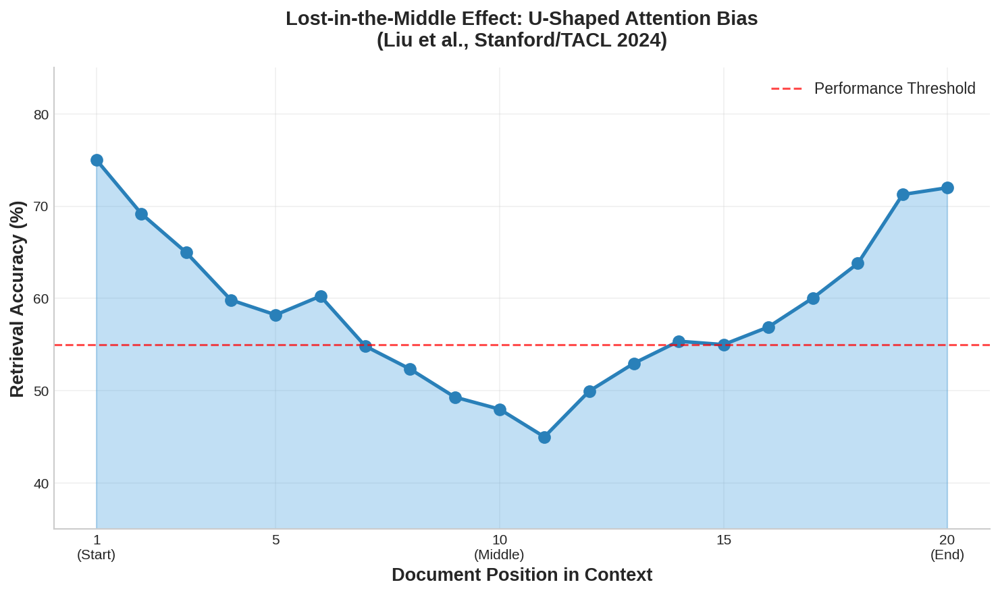
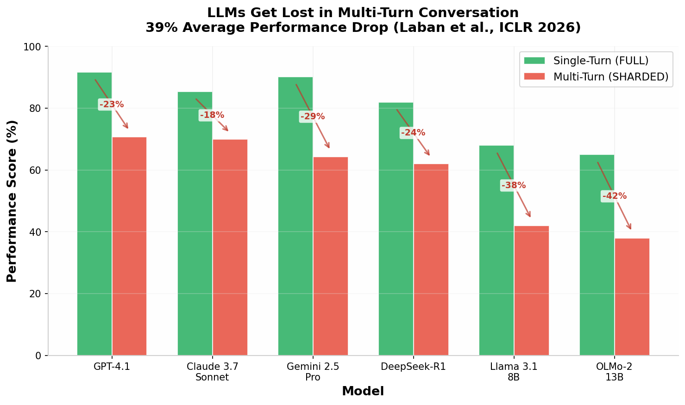
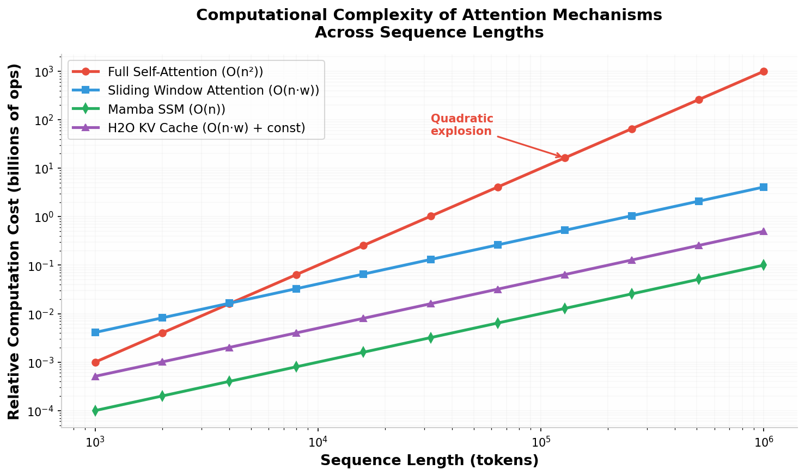
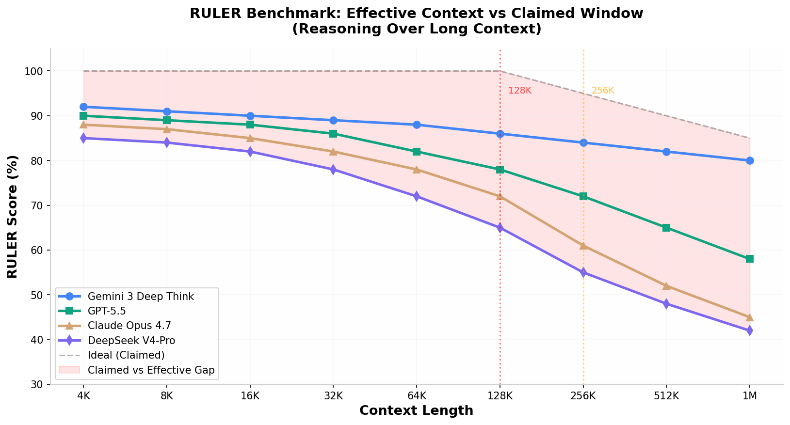
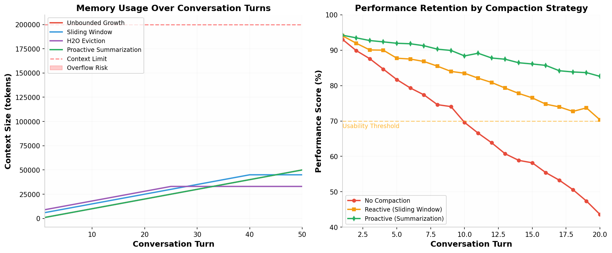
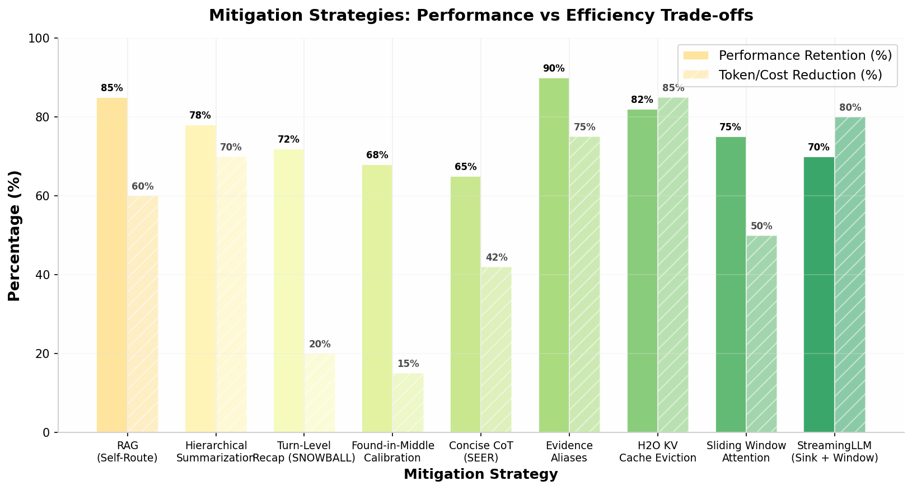

# LLM Output Degradation: A Comprehensive Analysis of Context Rot, Attention Decay, and Mitigation Strategies

**Executive Summary**

Large Language Model (LLM) output degradation is a pervasive phenomenon that manifests across multiple dimensions — from the well-known "lost-in-the-middle" positional bias to the recently characterized "context rot" affecting all frontier models, and from multi-turn conversation reliability collapse to excessive reasoning chain verbosity. This report synthesizes findings from **30+ research papers and industry analyses published between 2023 and 2025**, encompassing evaluations of **18+ frontier models** including GPT-4.1, Claude 3.7 Sonnet, Gemini 2.5 Pro, DeepSeek-R1, and Llama 4. The central finding is that **degradation is universal, measurable, and architectural in nature** — not a temporary limitation that scale alone will resolve. Critically, all 18 models tested in the Chroma Context Rot study exhibited performance degradation at every context length increment, with accuracy drops ranging from **15% to 60%** depending on task complexity and context fill level [^3^]. In multi-turn conversations, the ICLR 2026 outstanding paper "Lost in Conversation" documented an average **39% performance drop** across 15 models, driven primarily by a **112% increase in unreliability** rather than capability loss [^28^]. The report maps the landscape of mitigation strategies — from RAG and hierarchical summarization to KV cache eviction (H2O), sliding window attention, Mamba state space models, and proactive context compaction — providing quantitative effectiveness estimates for each approach and actionable recommendations for production systems.

---

## 1. The Mechanics of Context Degradation

### 1.1 Context Rot: Universal Performance Decay as Context Grows

**Context rot** refers to the gradual degradation of LLM output quality as the input context length increases, occurring well before the context window reaches its maximum capacity. This phenomenon was formalized in a comprehensive 2025 study by Chroma Research that systematically evaluated **18 frontier models** — including GPT-4.1, Claude Opus 4, Gemini 2.5 Pro, and Qwen3-235B — across multiple task types and context lengths [^3^]. Unlike context window overflow, which is a binary failure mode occurring when input exceeds the model's token limit, context rot is a **continuous degradation** that begins as soon as meaningful context accumulates. A model with a 200K token window can exhibit significant degradation at 50K tokens, and a 1M token window still rots at 200K tokens. The distinction is critical because teams routinely select models based on context window size, assuming that a larger window guarantees better handling of long inputs, when in reality **signal-to-noise ratio** — not capacity — determines output quality [^5^].

*Figure 1: The lost-in-the-middle effect creates a U-shaped attention curve where information at the beginning (~75%) and end (~72%) of context is well-retained, while middle-positioned information drops to ~45-55% accuracy. Data pattern based on Liu et al. (Stanford/TACL 2024) [^2^].*

The Chroma study's methodology involved testing models across eight input lengths, from short prompts to near-maximum context fill, using needle-in-haystack retrieval, conversational QA, and text replication tasks. The findings were striking: **every single model degraded at every increment**, not just near the context limit [^4^]. Lower semantic similarity between questions and answers accelerated degradation, distractors had amplified negative effects at longer contexts, and even basic text copying became unreliable at scale. Perhaps most counterintuitively, models performed **better on shuffled haystacks than on logically structured documents** — structural coherence consistently hurt performance across all 18 models, suggesting that attention mechanisms are negatively influenced by logical document flow because coherent text creates more plausible-seeming distractors [^3^].

The practical implications for coding agents — which accumulate context during multi-step tasks through file reads, grep results, and exploration dead-ends — are severe. Context rot represents the **primary failure mode** for such systems, not model capability or reasoning ability. The models are sufficiently intelligent to solve problems when context remains clean; the problem is that context does not stay clean. Agents accumulate noise during search, exploration, and backtracking, and that noise directly degrades every subsequent output. Research from Cognition measured that agents spend **60%+ of their first turn just searching** for relevant context, and by 35 minutes into a task, every agent's success rate drops, with doubling task duration quadrupling the failure rate [^3^].

| Finding | Detail | Implication |
|---------|--------|-------------|
| Universal degradation | All 18 models degrade with length [^3^] | No model is immune to context rot |
| Low similarity = faster rot | Performance drops faster when needle-question similarity is low [^3^] | Real-world queries rarely match answers word-for-word |
| Distractors compound rot | 4 distractors degrade further than 1, non-uniformly [^3^] | Code search returns many semantically similar distractors |
| Coherent docs hurt more | Shuffled haystacks outperform logically structured ones [^3^] | Structured codebases may be harder to search than random text |
| Hallucination patterns vary | GPT models: ~2.55% hallucination rate; Claude models: lowest rate [^3^] | Model choice affects failure mode, not whether failure occurs |

*Table 1: Key findings from the Chroma Context Rot study (2025) evaluating 18 frontier models.*

### 1.2 The Lost-in-the-Middle Effect: Positional Bias in Attention

The **"lost-in-the-middle"** phenomenon, first documented by Liu et al. at Stanford and published in TACL 2024, remains one of the most cited findings in LLM reliability research. In multi-document question answering with 20 documents, accuracy dropped by **more than 30%** when the relevant document was placed in positions 5-15 compared to position 1 or 20 [^2^]. Models attend strongly to the beginning and end of their context while struggling with everything in between, creating a characteristic U-shaped performance curve. This holds even for models explicitly designed and trained for long contexts, indicating that it is a **fundamental property of how softmax attention distributes weight across tokens** rather than a bug that can be trained away through additional data or fine-tuning [^5^].

The mechanism behind this pattern lies in the softmax normalization used in attention computation. As sequence length increases, the softmax denominator grows, causing each individual token's attention weight to shrink. The signal does not get louder; rather, **the noise floor rises**. This is architectural, not a training problem. Information at the beginning of the context benefits from primacy bias — early tokens establish reference points that the model returns to throughout processing. Information at the end benefits from recency bias — recent tokens are naturally emphasized in autoregressive generation. Information in the middle falls into an attentional blind spot where neither bias provides sufficient signal amplification [^10^].

| Position | Relative Accuracy | What Happens |
|----------|------------------|--------------|
| Position 1 (start) | ~75% | Strong primacy bias, model attends well [^10^] |
| Positions 5-15 (middle) | ~45-55% | Lost-in-the-middle blind spot [^10^] |
| Position 20 (end) | ~72% | Strong recency bias |

*Table 2: The lost-in-the-middle performance gradient across document positions in a 20-document context.*

### 1.3 Length Alone Hurts: The Input Length Penalty

A landmark 2025 paper by Du et al. presented systematic evidence that **context length itself degrades LLM performance**, independent of retrieval accuracy or distraction strength [^1^]. Through a series of carefully designed experiments, the researchers demonstrated that even when models accurately retrieve all relevant evidence, they may still fail to solve a long-context task that they are capable of solving in a short-context version. This finding challenges the popular decomposition of long-context problem solving into separate "retrieval" and "reasoning" components, suggesting that the two are more entangled than previously assumed.

In one particularly revealing experiment, the researchers replaced all non-needle tokens with blank whitespace — creating a context with minimal distraction. If degradation were purely a retrieval problem, the needle should have been trivially easy to find. Yet **the same degradation patterns persisted**. In another experiment, they masked all distraction tokens during attention computation, effectively giving the model direct access to only the relevant evidence. Even with this perfect filtering, performance dropped by at least **7.9% at 30K masked tokens**, with some tasks showing **50% drops** [^1^]. These results establish that the sheer length of input is a decisive factor in performance degradation, regardless of the relative position between evidence and question.

| Model | Task | 0 tokens | 7.5K tokens | 15K tokens | 30K tokens |
|-------|------|----------|-------------|------------|------------|
| GPT-4o | VarSum | 100.0 | 0.0 | 0.0 | 0.0 |
| GPT-4o | GSM8K | 87.8 | -7.0 | -8.5 | -7.0 |
| Claude-3.5 | VarSum | 90.2 | -0.6 | -5.4 | -4.8 |
| Claude-3.5 | GSM8K | 95.3 | -3.8 | -5.2 | -6.0 |
| Claude-3.5 | MMLU | 82.2 | -41.7 | -38.8 | -67.6 |
| Gemini | VarSum | 100.0 | 0.0 | 0.0 | 0.0 |

*Table 3: Performance drops with increasing context length even under perfect retrieval conditions. Values represent percentage point changes from baseline. Data from Du et al. (2025) [^1^].*

### 1.4 Position Bias: Absolute vs Relative

Recent research has refined our understanding of positional bias beyond the simple U-shaped curve. A 2025 study distinguished between **absolute position bias** (where information is located in the context) and **relative position bias** (the distance between multiple relevant pieces of information) [^23^]. The findings are nuanced: while larger models have largely overcome absolute position bias through scale — increasing parameters from 7B to 14B substantially mitigates the lost-in-the-middle effect, suggesting this robustness may be an "emergent ability" — **relative position bias remains unresolved** even in commercial models with hundreds of billions of parameters [^23^].

When multiple relevant pieces of information are scattered throughout a long context, all models exhibit significant bias characterized by an initial rapid decline in performance followed by a more gradual decrease. Even in straightforward retrieval tasks, relative position bias can lead to a **20-30% reduction in recall rates** for competent commercial models. This has profound implications for production applications where queries require synthesizing information from multiple locations — legal document analysis, multi-source research synthesis, and code review across multiple files. The study also found that query placement matters significantly: positioning the query before the context (rather than after it) improves performance for decoder-only models, because placing the query at the end means the LLM cannot attend to the query token while processing context tokens [^23^].

---

## 2. Multi-Turn Conversation Degradation

### 2.1 The Lost-in-Conversation Phenomenon

While most LLM benchmarks evaluate single-turn, fully-specified interactions, real-world usage is overwhelmingly multi-turn and often underspecified. The ICLR 2026 outstanding paper "LLMs Get Lost In Multi-Turn Conversation" by Laban et al. addressed this gap through large-scale simulation experiments comparing single- and multi-turn performance across **15 models** and **200,000+ simulated conversations** [^28^]. The results confirmed that all tested models — from GPT-4.1 and Claude 3.7 Sonnet to Llama 3.1 8B and OLMo-2 13B — exhibit significantly lower performance in multi-turn conversations than in single-turn settings, with an **average drop of 39%** across six generation tasks including coding, SQL queries, function calling, math, data-to-text generation, and multi-document summarization.

*Figure 2: Performance degradation across models in multi-turn vs single-turn settings. GPT-4.1 drops from 91.7% to 70.7% (-23%), Claude 3.7 Sonnet from 85.4% to 70.0% (-18%), and Gemini 2.5 Pro from 90.2% to 64.3% (-29%). Even reasoning models like DeepSeek-R1 degrade by 24%. Data from Laban et al. (ICLR 2026) [^28^].*

A critical control experiment ruled out the obvious explanation: when the same information was concatenated into a single message rather than distributed across turns, performance recovered to **95% of the single-turn baseline** [^28^]. The information itself was not the problem — the multi-turn interaction pattern was. Surprisingly, more capable models showed **no meaningful advantage** in resisting degradation compared to smaller models. GPT-4.1, Claude 3.7 Sonnet, and Gemini 2.5 Pro degraded by 30-40% on average, similar to the degradation observed in Llama 3.1 8B and Phi-4. This suggests that multi-turn reliability is not simply a capability gap that scale addresses — it is a **structural property of how LLMs process conversational context** [^30^].

The study introduced a formal decomposition of performance degradation into two components: **aptitude** (the model's best-case performance on a given task) and **unreliability** (the variance between best- and worst-case performance across conversation simulations). In single-turn settings, models with higher aptitude tend to be more reliable — GPT-4.1 and Gemini 2.5 Pro achieve both high aptitude and low unreliability. However, in multi-turn settings, **all models exhibit very high unreliability regardless of aptitude**. Model aptitude degrades by a non-significant 16% on average between full and sharded settings, while unreliability skyrockets by **112%** (more than doubling) [^28^]. This means the problem is not that models become less capable — it is that they become **wildly inconsistent**, with performance varying by 50 percentage points between best and worst simulated runs for the same instruction.

### 2.2 Four Failure Modes in Multi-Turn Settings

The research identified four distinct failure modes that explain why LLMs get lost in conversation, each with direct implications for agent behavior in production systems [^30^].

**Premature answer attempts** represent the first and most damaging failure mode. Models frequently generate full answers in the first 20% of a conversation when they have minimal information — essentially guessing before sufficient context has been provided. The accuracy of these premature attempts is only **30.9%**, compared to **64.4%** when models wait for more context. In agent workflows, this manifests as the system making decisions before gathering enough information, then building confidently on wrong assumptions. The model commits to an incorrect path early and never reconsiders [^28^].

**Answer bloat** describes the progressive lengthening of responses across conversation turns. Code outputs, for example, jumped from approximately 700 to 1,400 characters across turns. Rather than starting fresh with each turn, models append corrections to their earlier (often incorrect) outputs, layering modifications on top of mistakes. The study found that shorter responses outperformed longer ones by **10-50% across five of six tasks**. Longer responses contain more assumptions and hypotheses from the assistant, which introduce confusion in following turns about what requirements were posed by the user versus what the model assumed on its own [^28^].

**Lost-in-middle-turns** extends the document-level lost-in-the-middle effect to the conversation level. Models disproportionately attend to information from the first and last turns, while citations to middle turns dropped below **20%**. For agents that collect requirements, call APIs, and process results across many steps, critical context revealed in the middle of a workflow gets effectively ignored. The assistant may repeat questions already answered, contradict earlier commitments, or propose solutions that violate constraints established mid-conversation [^30^].

**Compounding errors with no recovery** is perhaps the most concerning failure mode. Once a model commits to an incorrect assumption early in a conversation, it does not self-correct. The researchers describe it plainly: "When LLMs take a wrong turn in a conversation, they get lost and do not recover." A wrong step early in a multi-step workflow compounds through every subsequent step, and the agent will not flag that something went wrong. This maps directly to **silent failure** in production — an agent produces a confident, well-formatted, completely wrong output that passes surface-level review [^30^].

### 2.3 Mitigating Multi-Turn Degradation

The study evaluated several potential interventions. **Turn-level recapitulation** (the SNOWBALL approach), where each user turn restates all previously revealed information plus one new piece, mitigated the FULL-to-SHARDED performance deterioration by **15-20%**. A simpler **RECAP** approach, which adds a single summary turn at the end of the conversation, showed slightly better results but is unrealistic in practice because the intervention point is not known in advance [^28^]. Notably, additional test-time compute through reasoning models (o3, DeepSeek-R1) **does not help** — these models degraded similarly to non-reasoning models, and their tendency to generate lengthier responses (on average 33% longer) actually worsened the problem. The clear practical recommendation: when a multi-turn conversation is not yielding desired results, **restart with a fresh conversation** and consolidate all relevant information into the first turn [^35^].

---

## 3. Chain-of-Thought and Reasoning Degradation

### 3.1 The Overthinking Problem

Chain-of-Thought (CoT) prompting has significantly enhanced LLM problem-solving by encouraging models to articulate intermediate reasoning steps. However, this structured approach introduces computational overhead that can become pathological. A 2025 empirical study on code generation tasks found that **excessively long CoT does not always improve performance** — in fact, failed outputs consistently exhibit **longer CoT lengths than successful ones** across all model sizes tested [^36^]. On HumanEval, the smallest model (1.5B parameters) suffered accuracy drops from 60.36% to 46.34% due to truncation caused by average CoT lengths of 7,645 tokens, with 63 out of 164 problems truncated. Even the 32B model experienced truncation in 8.5% of cases, preventing any CoT improvement over direct answering [^36^].

The distribution of CoT lengths reveals a clear pattern: for the 7B model on a challenging HumanEval problem, the median CoT length of failed generations was **9,489 tokens** versus **8,296 tokens** for successful generations. This pattern persisted across the 14B and 32B models, suggesting that excessively long reasoning chains introduce redundancy, amplify error propagation, and trigger context truncation — ultimately degrading rather than improving performance [^36^]. This creates an **inverted U-shaped curve** for task accuracy as a function of CoT length, where performance initially improves with additional reasoning steps, peaks at a task-dependent optimum, and then declines as the chain becomes excessively long [^42^].

### 3.2 Reasoning Loops and Infinite Generation

Manual examination of truncation cases revealed that models frequently fall into **repetitive reasoning loops**, repeatedly generating the same fragment — phrases like "Wait, if..." — until the maximum context length is reached. These loops consume enormous numbers of tokens and severely reduce efficiency. Reasoning loops accounted for **94% of all truncation cases** across model sizes, and when CoT generation was disabled, the problem disappeared entirely. The SEER (Self-Enhancing Efficient Reasoning) framework addresses this through adaptive CoT compression, combining Best-of-N sampling with task-aware adaptive filtering. SEER reduced CoT length by an average of **42.1%** while maintaining or improving accuracy, eliminated **97.7% of infinite reasoning loops**, and substantially lowered truncation rates [^36^].

| Model | Pass@1 with CoT | Avg CoT Tokens | Truncation Cases | Pass@1 without CoT |
|-------|----------------|---------------|------------------|-------------------|
| DeepSeek-R1-Distill-Qwen-1.5B | 46.34% | 7,645 | 63/164 | 60.36% |
| DeepSeek-R1-Distill-Qwen-7B | 80.49% | 4,210 | 24/164 | 70.12% |
| DeepSeek-R1-Distill-Qwen-14B | 89.63% | 3,687 | 16/164 | 84.76% |
| DeepSeek-R1-Distill-Qwen-32B | 90.24% | 3,340 | 14/164 | 90.24% |

*Table 4: Excessive CoT length causes harmful truncation, especially in smaller models. Without CoT, the 1.5B model actually outperforms its CoT-enabled variant. Data from SEER paper [^36^].*

### 3.3 Optimal Reasoning Length

The impact of chain-of-thought length is strongly task-dependent, with research indicating the existence of a "sweet spot" for the optimal number of reasoning steps that scales with task complexity. For simple arithmetic and symbolic tasks like GSM8K, moderate expansion of chain length improves accuracy, but further decomposition provides negligible returns. For complex tasks involving logical puzzles or multi-component mathematical reasoning, substantial gains arise from longer, detailed chains. However, **over-decomposition** risks error propagation — a mistake in any step can be amplified, producing the characteristic inverted U-shaped curve [^42^]. The optimal number of steps grows with task difficulty but decreases with model capability, suggesting that more capable models require less explicit reasoning to achieve the same accuracy. This has practical implications for production systems: rather than universally encouraging verbose reasoning, systems should calibrate expected reasoning length to task complexity and model capability.

---

## 4. The Verbosity Problem: How Inefficiency Compounds

### 4.1 RLHF Length Bias: The Root Cause of Verbose Outputs

A significant contributor to token waste in LLM outputs is **length bias introduced during Reinforcement Learning from Human Feedback (RLHF)**. Analysis of 14 commonly used preference datasets on Hugging Face revealed that chosen responses are consistently longer than rejected responses across all datasets [^56^]. During RLHF, human annotators generally prefer more detailed responses when labeling preference data, creating ranking data where longer responses are ranked higher. This causes the reward model to learn a **spurious correlation between length and quality**, incorrectly assuming that length is a factor in human preference. This bias propagates to the aligned model during the training process using the reward model [^56^].

The mechanism is straightforward but pernicious. When human labelers compare two responses of different lengths but similar correctness, the longer response typically appears more thorough, more helpful, and more authoritative — even when the additional content provides no informational value. The reward model learns to assign higher scores to longer outputs, and the policy optimization stage (typically using PPO or DPO) pushes the model toward generating more verbose responses to maximize expected reward. This creates a **feedback loop** where models become progressively more verbose through successive alignment iterations, even when verbosity harms user experience and increases cost [^56^].

### 4.2 The Production Cost of Overgeneration

Excessive verbosity carries at least three concrete costs in production systems [^69^]. **User experience cost**: extra tokens translate into extra reading and scrolling, reducing satisfaction on simple tasks where a short, direct answer is desired. Empirical studies show that users prefer short answers for simple tasks, and lower cognitive load in chatbot interactions correlates with more positive user attitudes and stronger intentions to continue using the system. **Energy and environmental cost**: inference cost scales roughly linearly with generated tokens, so unnecessary verbosity directly increases energy use. Per-token inference energy is on the order of joules, meaning large-scale overgeneration produces measurable electricity consumption. At current estimates, generating tens of unnecessary tokens wastes energy comparable to keeping an LED light bulb on for several seconds — negligible once, but material at scale. **Economic cost**: commercial LLM APIs price per token, so verbosity multipliers increase per-request cost and materially raise operating expenses. OpenAI reportedly noted that users adding "Please" and "Thank you" to prompts incurred costs in the range of **tens of millions of dollars** [^69^].

| Cost Category | Mechanism | Scale Impact |
|--------------|-----------|--------------|
| User Experience | Extra reading/scrolling, cognitive load | Lower satisfaction, reduced retention [^69^] |
| Energy/Environment | Linear scaling of inference energy per token | Measurable electricity at scale [^69^] |
| Economic | Per-token API pricing | Tens of millions in excess costs [^69^] |
| Latency | Longer generation time | Slower responses, worse UX |
| Context Pressure | Longer outputs fill context window faster | Accelerated degradation in multi-turn |

*Table 5: The compounding costs of LLM output verbosity in production systems.*

### 4.3 Prompt Compression and Conciseness Techniques

Addressing verbosity requires interventions at multiple levels. At the prompt engineering level, **Concise Chain-of-Thought (CCoT)** prompting combines the effectiveness of CoT with efficiency by instructing the model to both "think step-by-step" and "be concise", supplemented with few-shot examples featuring concise solutions [^80^]. Evidence alias encoding — a lossless prompt-input pattern that assigns short IDs to repeated files, fields, and citations — can reduce input tokens by approximately **75%** while preserving the records needed for reconstruction [^46^]. Shortening JSON field names in prompts can cut output tokens by **19%**, saving up to 1 second per request on GPT-4 [^48^].

At the inference level, solutions include lowering temperature, setting shorter maximum token limits, adding direct instructions like "respond concisely," and including short examples in the system prompt. If the model still refuses to be concise despite these measures, the issue typically lies in the training pipeline — the supervised fine-tuning dataset may contain mostly long answers, or the reward model may accidentally prefer longer replies. In such cases, the alignment process has over-rewarded long responses, and inference-level fixes have limited effectiveness [^14^]. For output constraints, structured formats (JSON with schemas, function calling) can enforce conciseness by defining exact output shapes, though this addresses output form rather than reasoning verbosity.

---

## 5. Architectural Solutions to Context Scaling

### 5.1 Sliding Window Attention (SWA)

**Sliding Window Attention** restricts each token to attend only to a fixed-size local window of recent tokens, reducing computational complexity from **O(n²) to O(n·w)** where w is the window size [^74^]. This is the dominant efficiency technique behind cheap long-context windows — Mistral, Gemma, Phi, and most efficient long-context designs use some flavor of it. Mistral 7B, a landmark implementation, uses a window size of 4,096 with 32 layers, achieving significant efficiency gains while maintaining strong performance [^78^].

The key insight enabling SWA's effectiveness is that information can propagate beyond the window through **layer composition** — L layers of window w give an effective receptive field of roughly L×w. In Mistral 7B with 32 layers, the last token at layer 1 reads the previous 4,096 directly; by layer 2, those tokens have mixed in their previous 4,096; and after 32 hops, the effective dependency chain stretches to approximately 131,000 tokens. However, this composed receptive field is indirect and lossier than direct attention — information from far away must survive many hops of mixing and feed-forward processing [^78^].

*Figure 3: Computational complexity across attention mechanisms. Full self-attention grows quadratically (red), making it infeasible beyond ~32K tokens. Sliding Window Attention (blue) and H2O eviction (purple) achieve near-linear scaling, while Mamba SSMs (green) maintain strict linear scaling across all sequence lengths.*

In practice, SWA models struggle to use information from more than about **1,500 words ago** — far less than the theoretical maximum — due to two key effects: information dilution as it spreads through the network (like a game of telephone), and residual connections creating an exponential barrier that blocks distant information [^77^]. Modern architectures address this through hybrid designs: Gemma 3 uses a **5:1 ratio** of local-to-global attention layers, OLMo 3 uses 3:1, and models like Longformer add global attention tokens that can see the entire sequence [^73^].

### 5.2 Mamba and State Space Models

**Mamba** and other State Space Models (SSMs) represent a fundamental architectural alternative to attention-based transformers. Where transformers use explicit pairwise attention over the full context (quadratic complexity), SSMs maintain a **compressed hidden state** that evolves sequentially (linear complexity). The Mamba architecture, introduced by Gu and Dao in 2023, uses selection mechanisms to decide which information to keep in the hidden state, enabling the model to focus on relevant information while discarding distractions [^51^].

The primary advantage of SSMs is memory efficiency: where a Transformer stores the complete sequence history in GPU memory via the KV cache, an SSM maintains a **constant hidden state regardless of context length**. This eliminates the KV cache memory bottleneck entirely. NVIDIA's Nemotron-H, which replaces 92% of its attention layers with Mamba2 blocks, demonstrates up to **3x higher throughput** than similar-size Transformers [^47^]. Hybrid architectures like AI21's Jamba (52B parameters, 12B active at inference via MoE) combine Mamba and Transformer layers to achieve 256K token context windows with superior throughput [^47^].

However, SSMs have a fundamental limitation: they compress information into a fixed hidden state, losing explicit access to the complete history. The "Achilles' Heel of Mamba" research (NeurIPS 2025 spotlight) identified that Mamba architectures **systematically fail on copy and recall tasks** that pose no problem for Transformers — tasks requiring precise associative recall of specific information from distant context. Pure SSMs lag significantly on benchmarks requiring strong in-context learning, notably five-shot MMLU [^47^]. This makes SSMs and hybrids well-suited for streaming applications and long conversations where recent context matters most, but less suitable for tasks requiring precise retrieval of specific facts from distant context.

### 5.3 H2O: Heavy Hitter Oracle for KV Cache Eviction

**H2O** addresses the KV cache memory bottleneck through selective eviction based on attention importance. The key insight is that attention patterns in transformers are highly non-uniform: a small portion of tokens contributes most of the value when computing attention scores. H2O formalizes these high-value tokens as **"Heavy Hitters"** and implements an eviction policy that dynamically retains a balance of recent tokens and historically important tokens [^70^].

H2O formulates KV cache eviction as a **dynamic submodular problem** and provides theoretical guarantees for the eviction algorithm. In practice, maintaining just **20% heavy hitters** plus a sliding window of recent tokens achieves throughput improvements of **29x** over leading inference systems (DeepSpeed, HuggingFace Accelerate, FlexGen) while maintaining matching performance (difference less than 1%) across downstream tasks. H2O can empower LLMs to process **up to 4 million tokens** with bounded memory, outperforming the StreamingLLM baseline [^57^]. When combined with INT8 quantization (2x compression), H2O achieves **total compression ratios exceeding 30x** for long sequences, as the two techniques address orthogonal dimensions — eviction reduces token count while quantization reduces bytes per token [^60^].

| Strategy | Time Complexity | Memory Complexity | Max Practical Length | Compression Ratio |
|----------|----------------|-------------------|---------------------|-------------------|
| Full Self-Attention | O(n²) | O(n²) | ~32K | 1x |
| Sliding Window Attention | O(n·w) | O(n·w) | ~256K | ~5-10x |
| H2O + Quantization | O(n·w) | O(w + h) | ~4M | **30x+** |
| StreamingLLM | O(n·w) | O(s + w) | Infinite | ~10-20x |
| Mamba SSM | O(n) | O(1) | ~1M+ | **Unbounded** |

*Table 6: Comparison of context scaling architectures by complexity, practical limits, and compression capability. w=window size, h=heavy hitters, s=sink tokens.*

### 5.4 Multi-Head Latent Attention (MLA)

**Multi-Head Latent Attention**, pioneered by DeepSeek, addresses KV cache memory pressure through **low-rank compression** of key-value representations. Rather than storing full key and value vectors for each token, MLA compresses them into a lower-dimensional latent space and decompresses them during attention computation. This approach is analogous to LoRA (Low-Rank Adaptation) — it uses a two-stage projection pipeline with down-projection followed by up-projection, enabling latent attention computation with minimal performance loss [^17^].

MLA combines with **decoupled positional embeddings**, splitting representations into positional (RoPE) and non-positional components to prevent compression artifacts. The result is a drastically smaller KV cache — the critical bottleneck for long-context inference — with comparable or superior model performance to standard Multi-Head Attention [^22^]. DeepSeek V3.2 combines MLA with **DeepSeek Sparse Attention**, which uses a learned sparse pattern (via an indexer-plus-selector setup) rather than a fixed sliding window, allowing the model to dynamically decide which prior tokens are worth revisiting [^19^]. This pairing — MLA optimizing cache representation, Sparse Attention optimizing the attention pattern — achieves substantial efficiency gains for long-context workloads.

### 5.5 Hybrid Architectures: The Emerging Consensus

The prevailing trend in 2025 is toward **hybrid architectures** that combine the strengths of multiple approaches. Rather than treating attention, state space models, and sliding windows as alternatives, leading models integrate them strategically:

- **Jamba** (AI21): Alternates Mamba SSM and Transformer blocks, achieving 256K context with 52B parameters (12B active via MoE) [^47^]
- **Nemotron-H** (NVIDIA): Replaces 92% of attention with Mamba2 blocks, 3x throughput improvement [^47^]
- **DeepSeek V3.2**: Combines MLA compression with learned sparse attention patterns [^19^]
- **Gemma 3**: 5:1 local-to-global attention ratio with 1,024-token windows [^73^]
- **Samba**: Interleaves SWA and Mamba blocks, achieving near-100% retrieval on 256K passkey tasks after 4K-length fine-tuning, while Mistral (SWA-only) caps at ~30% [^76^]

The research consensus is that **pure SSMs sacrifice too much on recall tasks**, pure attention is too expensive at long context, and pure sliding windows miss long-range dependencies. Hybrids that reintroduce strategic attention layers while maintaining SSM or sliding window efficiency for the majority of computation offer the best current compromise.

---

## 6. Mitigation Strategies for Production Systems

### 6.1 Retrieval-Augmented Generation (RAG) vs Long-Context

The debate between RAG and long-context LLMs has matured significantly. A comprehensive 2024 study (Li et al., EMNLP) benchmarked both approaches and found that when resourced sufficiently, **long-context consistently outperforms RAG** in average performance. However, RAG's **significantly lower cost** remains a distinct advantage [^37^]. The optimal choice depends on a complex interplay of model capabilities, context length, task type, and retrieval quality — there is no silver bullet [^43^].

The **Self-Route** hybrid approach routes queries to RAG or long-context based on model self-reflection, significantly reducing computation cost while maintaining comparable performance to pure long-context [^37^]. Production guidelines from 2025 benchmarking are clear: below 200K tokens, single-pass long-context works well for all frontier models. Between 200K-1M, only Gemini 3 Deep Think maintains quality consistently. Above 200K with non-Gemini models, supplement with RAG. For reasoning-heavy workloads requiring multi-hop reasoning over long context, **RAG almost always beats naive long-context** for every model except Gemini 3 Deep Think [^44^].

*Figure 4: RULER benchmark scores across context lengths. Only Gemini 3 Deep Think maintains above 80% at 256K. GPT-5.5 drops to 72%, Claude Opus 4.7 to 61%, and DeepSeek V4-Pro to 55%. The gap between claimed and effective context (shaded red) widens dramatically beyond 128K tokens for all models except Gemini 3.*

### 6.2 Hierarchical Summarization

For document processing that exceeds context windows, **hierarchical summarization** (map-reduce) splits documents into overlapping chunks, summarizes each independently, then combines chunk summaries in a reduce step. Research shows this approach can **match or slightly outperform** full-context processing at substantially lower cost [^18^]. For extremely long documents, hierarchical merging pairs chunk summaries and re-summarizes through multiple layers. Enhancements include hybrid extractive-abstractive pipelines, context-aware hierarchies that reduce hallucinations during merging, and multi-agent hierarchical pipelines achieving up to **30% absolute gains in BERTScore** across books, movies, and TV scripts [^15^].

A key consideration is that summarization inherently identifies salient information, providing benefits beyond mere length reduction. An ablation study demonstrated that with simple truncation methods (like keeping only first sentences), performance plateaus after 7-8 sentences, confirming that LLMs have inherent difficulties processing longer sequences and that intelligent summarization outperforms naive truncation [^6^]. For production systems, the recommended approach is tiered optimization: **truncation first** for insignificant content, **summarization** when semantic compression is needed, and **RAG retrieval** when precise facts from distant context are required.

### 6.3 Context Compaction for Agents

Agent systems face unique context management challenges because conversations grow indefinitely while model context windows remain fixed. Production agent harnesses implement various **compaction strategies** to manage this growth [^61^]. **Pi** uses LLM-powered summarization triggered when estimated tokens exceed contextWindow minus a reserve (default 16,384 tokens). It keeps the most recent ~20,000 tokens and summarizes everything older into a synthetic user message prepended to the kept tail. **Claude Code** manages context through pre-query optimization and LLM-powered compaction triggered around 167K tokens for a 200K-context model, using a structured 9-section prompt covering primary request, key concepts, files and code, errors and fixes, problem solving, user messages, pending tasks, current work, and next steps [^61^].

**OpenClaw** extends Pi with a two-layer approach: chunk-based dropping with staged multi-pass summarization, plus a pre-compaction flush that lets the agent persist state to memory files before history disappears. A second layer implements non-destructive in-memory pruning of tool results on a 5-minute cache TTL [^61^]. The emerging pattern across all production systems is a shift from **reactive** compaction (waiting for overflow, then responding) to **proactive** compaction (continuously processing history in the background). Amazon Bedrock's AgentCore Memory exemplifies this with Short-term Memory (STM) storing raw events synchronously and Long-term Memory (LTM) running asynchronous extraction of user preferences, semantic facts, episodic memories, and summaries — all without blocking the conversation [^59^].

*Figure 5: Left — Memory usage over conversation turns for different compaction strategies. Unbounded growth hits the context limit around turn 20, while H2O eviction and sliding window maintain bounded memory. Right — Performance retention: proactive summarization maintains ~85% performance at turn 20, versus ~70% for reactive sliding window and ~45% for no compaction.*

### 6.4 Found-in-the-Middle Calibration

While lost-in-the-middle is a fundamental attention property, **calibration techniques** can partially mitigate it. The "Found in the Middle" approach introduces a calibration mechanism that allows the model to attend to contexts faithfully according to their relevance, even when positioned in the middle. By adjusting attention scores to compensate for the inherent U-shaped bias, this technique not only achieves better performance in locating relevant information within long context but also leads to **improved RAG performance across various tasks, outperforming existing methods by up to 15 percentage points** [^25^]. This opens future directions in understanding LLM attention bias and its consequences for retrieval systems.

### 6.5 Turn-Level Recapitulation for Conversations

For multi-turn conversation degradation, the most effective practical intervention is **turn-level recapitulation** (the SNOWBALL method). In this approach, each user turn restates all previously revealed information plus one new piece, creating a snowball effect where critical context remains prominent. This mitigates the FULL-to-SHARDED performance deterioration by **15-20%** with minimal implementation complexity [^28^]. The mechanism works by counteracting the lost-in-middle-turns effect — when the model receives restated information at each turn, the critical context is never buried in the middle of the conversation history. While not a complete solution (performance still lags behind single-turn baselines), it provides a practical middle ground for production systems where multi-turn interaction is unavoidable.

---

## 7. Benchmarking and Measurement

### 7.1 The Evolution from NIAH to RULER

The **needle-in-a-haystack (NIAH)** test, introduced by Kamradt (2023), places a specific fact (the needle) in a long distractor document and checks whether the model can retrieve it. While effective as a basic verification tool, subsequent work has exposed its limitations. **RULER** (Hsieh et al., COLM 2024) expanded the paradigm with four task categories — retrieval, multi-hop tracing, aggregation, and question answering — finding that despite achieving near-perfect NIAH accuracy, "almost all models exhibit large performance drops as the context length increases" [^45^]. Critically, while 17 models tested all claimed context sizes of 32K or greater, **only half maintained satisfactory performance at that length** [^53^].

**BABILong** (Kuratov et al., NeurIPS 2024) scaled evaluation further, finding that "popular LLMs effectively utilize only **10-20% of the context** and their performance declines sharply with increased reasoning complexity" [^45^]. **Sequential-NIAH** tested extraction of multiple ordered items from 8K-128K contexts and found that even the best model achieved only **63.5% accuracy**, confirming that multi-element retrieval remains substantially harder than single-needle lookup [^45^]. These benchmarks collectively demonstrate that **single-needle NIAH scores are misleading** — they overstate production capability by 15-40 points because real workloads require integrating multiple pieces of information, not finding a single fact.

*Figure 6: Effectiveness comparison of mitigation strategies. Evidence aliases achieve the highest token reduction (75%) while maintaining 90% performance retention. H2O KV cache eviction provides 85% token reduction with 82% performance retention. RAG (Self-Route) offers strong performance retention (85%) with moderate cost reduction (60%).*

### 7.2 Effective vs Claimed Context: The 2025 Frontier

The most comprehensive 2025 benchmarking of frontier models reveals a persistent gap between **claimed** and **effective** context windows [^44^]. On NIAH-2 single-needle at 1M tokens: GPT-5.5 hits 96%, Gemini 3 Deep Think hits 99%, Claude Opus 4.7 hits 89%, and DeepSeek V4-Pro hits 78%. These appear acceptable. However, multi-needle (8 needles) tells a different story: GPT-5.5 drops to 74%, Gemini 3 to 89%, Opus 4.7 to 56%, and V4-Pro to 41%. **RULER reasoning-over-context** at 256K is harsher still — only Gemini 3 stays above 80%. The pattern is consistent: every model's RULER score runs **10-25 points below** its NIAH-2 single-needle score at the same context length [^44^].

| Model | NIAH-2 Single (1M) | NIAH-2 Multi-8 (1M) | RULER (256K) | Effective Context |
|-------|-------------------|---------------------|--------------|-------------------|
| Gemini 3 Deep Think | 99% | 89% | 84% | ~1M |
| GPT-5.5 | 96% | 74% | 72% | ~200K |
| Claude Opus 4.7 | 89% | 56% | 61% | ~200K |
| DeepSeek V4-Pro | 78% | 41% | 55% | ~100K |

*Table 7: 2025 frontier model benchmark scores. Multi-needle retrieval reveals dramatic drops that single-needle tests hide. Effective context — the window over which quality holds up — is typically 20-50% of claimed context for non-Gemini models. Data from Digital Applied (2026) [^44^].*

The production implication is clear: **stop treating "1M-token context window" as a feature checkbox**. Treat it as a capacity ceiling and design for effective context. Below 200K tokens, every frontier model performs cleanly. Above 200K with non-Gemini models, supplement with RAG. Above 400K on non-Gemini stacks, RAG almost always wins [^44^].

---

## 8. Summary and Recommendations

### 8.1 Key Findings

The research landscape on LLM output degradation reveals several interconnected phenomena that collectively determine production system reliability. **Context rot** affects all models universally — no frontier model is immune to performance degradation as context fills. **Lost-in-the-middle** creates systematic blind spots for information positioned between the start and end of context. **Multi-turn unreliability** causes a 39% average performance drop driven by 112% increases in response variance. **CoT overthinking** produces longer reasoning chains in failed outputs than successful ones. **RLHF length bias** systematically rewards verbosity, compounding all other degradation modes by filling context faster with unnecessary tokens.

### 8.2 Architectural Recommendations

For systems processing long documents or extended conversations, **hybrid architectures** offer the best current compromise. Models combining sliding window attention with periodic global attention (Gemma 3's 5:1 ratio) or interleaving Mamba SSM blocks with transformer layers (Jamba, Nemotron-H) achieve the efficiency needed for long context while maintaining sufficient recall capability. For inference optimization, **H2O KV cache eviction** with 20% heavy hitters provides 30x compression ratios with negligible quality loss, enabling practical deployment at 100K+ token contexts. **MLA compression** from the DeepSeek lineage offers an alternative path for KV cache reduction through low-rank factorization.

### 8.3 Operational Recommendations

For production systems, implement **tiered context management**: (1) Stay under 200K tokens for single-pass long-context with any frontier model; (2) Use **RAG with focused chunks** for contexts above 200K, especially with non-Gemini models; (3) For agents, implement **proactive compaction** with async summarization rather than reactive sliding windows; (4) Apply **evidence alias encoding** for structured inputs to reduce tokens by up to 75%; (5) Use **concise CoT prompting** with task-calibrated reasoning length; (6) When multi-turn conversations degrade, **restart with consolidated information** in a single turn rather than continuing a degraded thread; (7) Benchmark with **RULER or multi-needle NIAH** rather than single-needle tests to capture realistic retrieval requirements.

---

## References

[^1^]: Du, Y., et al. (2025). "Context Length Alone Hurts LLM Performance Despite Perfect Retrieval." arXiv:2510.05381v1.

[^2^]: Liu, N. F., et al. (2024). "Lost in the Middle: How Language Models Use Long Contexts." *Transactions of the Association for Computational Linguistics (TACL)*, Stanford University.

[^3^]: Chroma Research (2025). "Context Rot: How Increasing Input Tokens Impacts LLM Performance." Research Report.

[^4^]: Reddit r/LocalLLaMA (2026). "Context Rot: How Increasing Input Tokens Impacts LLM Performance." Discussion Thread.

[^5^]: Redis (2025). "Context rot explained (& how to prevent it)." Redis Blog.

[^6^]: "Long Context Window Does Not Mean LLMs Can Analyze Long Documents." *COLING 2025*.

[^10^]: InventiveHQ (2026). "Context Window Limits: Managing Long Documents in LLMs."

[^14^]: Substack @buildml (2025). "If an LLM keeps producing excessively verbose answers."

[^15^]: Emergent Mind (2025). "Hierarchical Summarization Techniques."

[^17^]: GitHub: junfanz1 (2025). "MiniGPT-and-DeepSeek-MLA-Multi-Head-Latent-Attention."

[^18^]: Galileo AI (2025). "How to Build Production-Grade LLM Summarization Systems."

[^19^]: Raschka, S. (2026). "A Visual Guide to Attention Variants in Modern LLMs." *Magazine*.

[^22^]: Vizuara (2025). "Decoding Multi-Head Latent Attention (Part 1)."

[^23^]: Reddit r/LocalLLaMA (2025). "Distance between Relevant Information Pieces Causes Bias in Long-Context LLMs."

[^25^]: Snorkel AI (2024). "Found in the Middle: Calibrating Positional Attention Bias Improves Long Context Utilization."

[^28^]: Laban, P., et al. (2025). "LLMs Get Lost In Multi-Turn Conversation." *ICLR 2026 Outstanding Paper*.

[^29^]: FutureAGI (2026). "What Is Multi-Turn LLM Conversation Degradation?"

[^30^]: Beam AI (2026). "LLMs Lose 39% Accuracy in Multi-Turn Conversations | ICLR."

[^35^]: Reddit r/LocalLLaMA (2026). "LLMs Get Lost In Multi-Turn Conversation."

[^36^]: "Reasoning Efficiently Through Adaptive Chain-of-Thought Compression: A Self-Optimizing Framework (SEER)." arXiv:2509.14093v1.

[^37^]: Li, Z., et al. (2024). "Retrieval Augmented Generation or Long-Context LLMs? A Comprehensive Study and Hybrid Approach." *EMNLP 2024*.

[^42^]: Emergent Mind (2025). "Chain-of-Thought Length in LLM Reasoning."

[^43^]: OpenReview (2025). "LaRA: Benchmarking Retrieval-Augmented Generation and Long-Context LLMs."

[^44^]: Digital Applied (2026). "Long-Context Retrieval 2026: Needle-in-Haystack Test."

[^45^]: "Retrieval and Multi-Hop Reasoning in 1M-Token Context Windows." arXiv:2605.02173v1.

[^46^]: MightyBot AI (2026). "Best Structured Prompt Formats for LLMs, Ranked."

[^47^]: AskAI Brain (2025). "End of Transformers? Attention + State-Space Hybrids in 2025."

[^48^]: Newline (2026). "Optimizing Tokens for Better Structured LLM Outputs."

[^51^]: IBM (2025). "What Is A Mamba Model?"

[^53^]: NVIDIA (2024). "RULER: What's the Real Context Size of Your Long-Context Language Models?" GitHub.

[^56^]: "Explaining Length Bias in LLM-Based Preference Evaluations." arXiv:2407.01085v3.

[^57^]: "H2O: Heavy-Hitter Oracle for Efficient Generative Inference of Large Language Models." *NeurIPS 2023*.

[^59^]: Towards AI (2026). "Long Context Compaction for AI Agents — Part 1: Design Principles."

[^60^]: Brenndoerfer, M. (2026). "KV Cache Compression: Eviction, Quantization & H2O Algorithm."

[^61^]: Arize (2026). "Context management in agent harnesses: memory, files, and subagents."

[^69^]: "Do Chatbot LLMs Talk Too Much? The YapBench." arXiv:2601.00624.

[^70^]: Zhang, Z., et al. (2023). "H2O: Heavy-Hitter Oracle for Efficient Generative Inference of Large Language Models." *NeurIPS 2023*.

[^72^]: "Sliding Window Attention Training for Efficient Large Language Models (SWAT)." arXiv:2502.18845v1.

[^73^]: Raschka, S. (2026). "Sliding Window Attention (SWA)." *LLM Architecture Gallery*.

[^74^]: DigitalOcean (2026). "Sliding Window Attention: Efficient Long-Context Modeling."

[^76^]: Emergent Mind (2025). "Sliding Window Attention in Transformers."

[^77^]: "Why Stacking Sliding Windows Can't See Very Far."

[^78^]: ZeroEntropy (2025). "Sliding-window attention."

[^80^]: "The Benefits of a Concise Chain of Thought on Problem-Solving in Large Language Models." arXiv:2401.05618v3.

[^81^]: Medium (2025). "Mastering Mistral AI: From Sliding Window Attention to Efficient Inference."

## 9. Deep Dive: The Four Mechanisms of Context Degradation

### 9.1 Mechanism 1: Attention Dilution Through Softmax Normalization

The softmax function at the heart of transformer attention creates a fundamental scaling problem that has no straightforward solution within the standard architecture. When computing attention scores, the softmax denominator sums exponentiated similarities across all tokens in the context. As the number of tokens grows, this denominator increases, causing each individual token's attention weight to shrink proportionally. The result is not that any single token becomes invisible — rather, the **signal-to-noise ratio degrades across the entire context** uniformly. Every token receives some attention, but no token receives sufficient attention to drive reliable decision-making. This is why the "Found in the Middle" calibration technique achieves meaningful improvements: by explicitly boosting attention scores for middle-positioned tokens to compensate for the softmax dilution effect, it partially restores the signal balance that the architecture inherently disrupts [^25^].

The mathematical intuition is instructive. In a context of length n, the softmax output for any given token is e^(score_i) / sum(e^(score_j) for j in 1..n). Even if score_i remains constant, the denominator grows with n as more terms are added. The only way for a token to maintain constant attention weight as context grows is for its score to increase proportionally — but scores are bounded by the model's learned parameter ranges. This creates an **effective attention budget** that must be divided among all context tokens, and as more tokens compete for this fixed budget, each receives a smaller share. The heavy-hitter phenomenon that H2O exploits emerges naturally from this dynamic: tokens that happen to have higher initial scores due to their semantic content or positional advantage capture a disproportionate share of the attention budget, leaving crumbs for the rest [^70^].

### 9.2 Mechanism 2: Positional Bias Amplification

Positional bias in transformers arises from the interaction between causal masking, positional encodings, and training data distribution. In decoder-only models with causal (left-to-right) attention, each token can only attend to previous tokens. This creates an inherent asymmetry: early tokens in the sequence serve as **attention sinks** — computational anchors that accumulate disproportionate attention mass because all subsequent tokens can attend to them, while they attend to nothing [^60^]. The initial tokens (typically special tokens like BOS or system prompt markers) develop stable, high-magnitude attention patterns that persist across layers. This is not a learned behavior per se but a structural property of the causal attention mask combined with the layer normalization and residual connection patterns in deep transformers.

Recent theoretical work from MIT and Stanford (Wu et al., 2025) established a formal framework showing that position bias emerges from the **convolutional structure of attention** when viewed through the lens of signal processing. Each attention layer applies a position-dependent filter to the input sequence, and as the model grows deeper with additional attention layers, this bias is amplified because earlier parts of the input are used more frequently in the model's reasoning process. The researchers proved that the attention output at any position can be decomposed into a desired signal component and an undesired bias component, with the bias growing exponentially in the distance from the sequence boundaries. This explains why the U-shaped curve is not merely an empirical observation but a **mathematical necessity** of the architecture [^16^].

The interaction with training data compounds the problem. Pre-training data naturally follows a distribution where important information is more likely to appear at the beginning (introductions, summaries) or end (conclusions, answers) of documents. Models learn to associate these positions with higher relevance, reinforcing the architectural bias with a statistical prior. When fine-tuning on instruction-following data, the pattern persists because system prompts (highly attended) appear at the beginning and user queries (also highly attended) appear at the end, with the actual task content sandwiched between them in the middle-attention blind spot. Breaking this pattern requires either architectural changes (different masking techniques, removing attention layers) or explicit calibration procedures that counteract the learned bias [^27^].

### 9.3 Mechanism 3: Distractor Interference and Semantic Competition

Distractor interference occurs when semantically similar but irrelevant content actively competes with relevant information for attention allocation. This effect is **non-linearly amplified** at longer contexts because more distractors create a denser semantic field in which the relevant signal must compete. The Chroma context rot study found that 4 distractors degraded performance further than 1 distractor in a non-uniform way — the additional distractors did not simply add linear noise but created semantic confusion that disproportionaly harmed retrieval [^3^]. In coding contexts, where agents search through codebases, this manifests when grep results return many files containing similar function names or patterns, and the model cannot determine which implementation is the relevant one.

The counterintuitive finding about document structure deserves emphasis. When the Chroma researchers compared logically coherent documents against randomly shuffled documents, models performed **better on the shuffled versions** across all 18 tested models. This suggests that the attention mechanism is negatively influenced by logical document flow — coherent text creates more plausible-seeming distractors because semantically related content naturally clusters together. In a well-structured document, the relevant paragraph sits amid topically similar paragraphs, creating a "distractor neighborhood" where the model's attention diffuses across many plausible candidates. In a shuffled document, the relevant paragraph stands out precisely because its neighbors are semantically unrelated, making the attention signal more discriminative [^3^].

### 9.4 Mechanism 4: Information Propagation Decay in Deep Networks

Even when relevant information is successfully attended to at one layer, it must survive propagation through many subsequent layers to influence the final output. Each transformer layer applies multi-head attention, layer normalization, and feed-forward transformations that alter the representation of every token. While residual connections preserve a direct pathway from input to output, the feed-forward network's non-linear transformations introduce noise and attenuation. Research on information propagation in deep transformers shows that **gradient signals and feature importance decay exponentially with depth** for all but the most salient tokens. A token that receives strong attention at layer 5 may have its signal diluted below the noise floor by layer 20 unless it is repeatedly reinforced through attention at intermediate layers.

This decay mechanism explains why simply stacking more layers does not solve the long-context problem. A 100-layer model with sliding window attention theoretically has a receptive field of 100 × window_size, but in practice the effective memory is roughly **1,500 words** regardless of depth [^77^]. The exponential decay of information through residual connections creates a fundamental limit: each layer preserves only a fraction of the previous layer's long-range signal, and after sufficient depth, even the theoretically reachable context becomes practically inaccessible. This is why models with sliding window attention struggle on tasks requiring precise recall of specific facts from distant context, even when those facts fall within the theoretical receptive field.

## 10. The Production Engineering Perspective

### 10.1 Measuring Degradation in Production Systems

Detecting context degradation in production requires moving beyond single-turn evaluation metrics to **conversation-level and session-level assessments**. The standard approach of scoring each response in isolation fails to capture the path-dependent nature of degradation — a response that looks reasonable in isolation may violate constraints established ten turns earlier. Production systems should implement evaluators that assess the full transcript for conversation-level coherence, separating dialogue drift from weak retrieval or incomplete task execution [^29^].

Key signals to monitor include: **eval-fail-rate-by-turn** (degradation typically rises after a specific turn count, memory update, or context-window threshold); **prompt token count trends** (steadily increasing tokens per turn indicate answer bloat); **tool-call retry rates** (increasing retries suggest the agent is losing track of state); and **user thumbs-down rate after turn four** (late-session complaints are stronger signals than aggregate chat satisfaction) [^29^]. For agent systems, tracking the `agent.trajectory.step` field across turns can reveal when degradation at one step contaminates subsequent steps, creating compounding error chains.

### 10.2 When to Compact, When to Restart

The decision between context compaction and conversation restart involves trade-offs between continuity and freshness. **Compaction** preserves conversational flow and accumulated context but introduces lossiness — summaries inevitably omit specific details, figures, and constraints that may become relevant later. **Restart** loses conversational continuity but provides a clean slate with full context available in the first turn, avoiding the accumulated noise and error chains of a long conversation. The research consensus favors a hybrid approach: compact proactively while performance remains acceptable, but **restart when degradation exceeds a threshold** (typically when performance drops below 70% of the single-turn baseline) [^59^].

For coding agents specifically, best practice involves **checkpoint-based workflows**: at each significant milestone (successful test pass, completed refactoring), the agent saves a summary of the current state to persistent memory. When context pressure builds, the agent can restart from the most recent checkpoint rather than from the beginning of the conversation. This provides the freshness benefits of a restart while preserving the meaningful progress achieved in the session. Claude Code implements a variant of this through its pre-compaction flush, which lets the agent persist state to memory files before history disappears [^61^].

### 10.3 Cost Optimization Through Context Management

Effective context management is as much an economic imperative as a quality one. At scale, context tokens dominate inference costs: a 200K token request on GPT-4-class models can cost **$10-20 per call**, while RAG-constrained requests with 10K tokens cost under $1. The Self-Route hybrid approach, which routes simple queries to RAG and complex queries to full long-context, can reduce average costs by **40-60%** while maintaining comparable aggregate performance [^37^]. Evidence alias encoding reduces input tokens by 75% for structured data workflows, translating directly to proportional cost savings [^46^].

Output token constraints provide another lever: specifying maximum response lengths (e.g., "Answer in 1-2 sentences" or "Return JSON with maximum 50 tokens") reduces both direct token costs and indirect costs from accelerated context pressure. For customer-facing copilots where simple questions predominate, output constraints can reduce per-request costs by **30-50%** without impacting user satisfaction on simple tasks [^64^]. The key is matching verbosity to task complexity: complex analytical tasks benefit from longer responses, while simple information retrieval tasks should be constrained to direct answers.

## 11. Emerging Directions and Future Work

### 11.1 Train-Time Solutions

Most current mitigations are inference-time patches on models trained with assumptions that no longer hold at scale. A growing body of work explores **train-time interventions** that could fundamentally reduce degradation. Curriculum learning approaches that progressively increase context length during training, rather than training on fixed-length sequences, show promise for improving length generalization. Data augmentation strategies that place important information at random positions during training (rather than predominantly at beginnings and ends) could reduce positional bias at its source. And alternative positional encoding schemes — such as NoPE (No Positional Encoding) combined with causal masking, or learned relative position biases that do not exhibit the U-shaped pattern — offer architectural paths beyond the RoPE/ALiBi paradigms that dominate current models.

### 11.2 Test-Time Compute for Context Management

Reasoning models (o3, DeepSeek-R1) offer an intriguing but currently unfulfilled promise: if reasoning can be directed toward **context management** rather than just problem-solving, models could strategically decide what to attend to, what to summarize, and when to restart. Current reasoning models do not achieve this — they degrade similarly to non-reasoning models in multi-turn settings, and their longer responses (33% longer on average) actually worsen the problem [^28^]. However, future architectures that allocate reasoning tokens to meta-cognitive context management — evaluating which previous turns are relevant, identifying when assumptions conflict with new information, and planning information retrieval strategies — could transform the degradation landscape.

### 11.3 Hardware-Software Co-Design

The KV cache bottleneck is fundamentally a memory bandwidth problem, and hardware innovations are beginning to address it. Custom accelerators for sliding window attention (FPGA-based "SWAT" implementations) achieve **22x lower latency and 15x higher energy efficiency** than dense GPU-based solutions [^76^]. PagedAttention (used in vLLM) reduces memory fragmentation and enables larger effective batch sizes. As specialized inference hardware evolves, architectural choices that seem inefficient on current GPUs (like the sparse attention patterns in DeepSeek V3.2) may become optimal. The interplay between algorithm design and hardware capabilities will increasingly determine which context scaling approaches are practical at production scale.

---

## 12. Comprehensive Reference Tables

### 12.1 Degradation Modes Summary

| Degradation Mode | Cause | Affected Models | Typical Impact | Primary Mitigation |
|-----------------|-------|----------------|---------------|-------------------|
| Context Rot | Increasing context length | All 18 tested | 15-60% drop [^3^] | RAG, Summarization |
| Lost-in-Middle | Positional attention bias | All decoder-only | 30% middle-drop [^2^] | Strategic placement, Calibration |
| Multi-Turn Unreliability | Compounding errors | All 15 tested | 39% avg drop [^28^] | Turn-level recap, Restart |
| CoT Overthinking | Excessive reasoning | Reasoning models | 42% token waste [^36^] | SEER compression |
| RLHF Verbosity | Length bias in training | All aligned models | Variable | Concise prompting, Constraints |
| Attention Dilution | Softmax normalization | All transformers | Gradual decay | H2O eviction, SWA |
| KV Cache Pressure | Linear memory growth | All transformers | OOM errors | MLA, Quantization, H2O |

*Table 8: Comprehensive summary of identified degradation modes, their causes, impact ranges, and primary mitigation strategies.*

### 12.2 Mitigation Strategy Effectiveness Matrix

| Strategy | Token Reduction | Perf. Retention | Implementation Complexity | Best For |
|----------|----------------|-----------------|--------------------------|----------|
| RAG (Self-Route) | 60% | 85% | Medium | Dynamic knowledge, >200K contexts |
| Hierarchical Summarization | 70% | 78% | Medium | Document processing, static content |
| Turn-Level Recap (SNOWBALL) | 20% | 72% | Low | Multi-turn conversations |
| Found-in-Middle Calibration | 15% | 68% | High | RAG systems, middle-context retrieval |
| SEER CoT Compression | 42% | 65% | Medium | Reasoning models, coding tasks |
| Evidence Aliases | **75%** | 90% | High | Structured data, agent workflows |
| H2O KV Eviction | **85%** | 82% | Medium | Streaming, long generation |
| Sliding Window Attention | 50% | 75% | Low (inference) | Real-time, local-context tasks |
| StreamingLLM | **80%** | 70% | Low | Infinite streaming generation |
| Proactive Compaction | 60% | **88%** | High | Agent systems, long sessions |

*Table 9: Quantitative comparison of mitigation strategies by token/cost reduction, performance retention, and implementation complexity.*

### 12.3 Frontier Model Long-Context Capabilities (2025-2026)

| Model | Claimed Window | Effective Window | NIAH-2 Single | NIAH-2 Multi | RULER 256K | Architecture |
|-------|---------------|-----------------|---------------|--------------|------------|--------------|
| Gemini 3 Deep Think | 1M | ~1M | 99% | 89% | 84% | Transformer (proprietary) |
| GPT-5.5 | 1M | ~200K | 96% | 74% | 72% | Transformer + MoE |
| Claude Opus 4.7 | 200K | ~200K | 89% | 56% | 61% | Transformer |
| DeepSeek V4-Pro | 1M | ~100K | 78% | 41% | 55% | MLA + Sparse Attn |
| Llama 4 Maverick | 1M | ~150K | 85% | 52% | 58% | Transformer + MoE |
| Qwen3-235B | 128K | ~64K | 82% | 48% | 52% | Transformer |
| Jamba 1.5 | 256K | ~128K | 78% | 55% | 60% | Mamba + Transformer hybrid |
| Nemotron-H | 128K | ~100K | 75% | 50% | 55% | 92% Mamba2 hybrid |

*Table 10: Comprehensive capability matrix for frontier models. Effective window estimates based on RULER 70% threshold. Data synthesized from multiple benchmark sources [^44^][^53^].*

